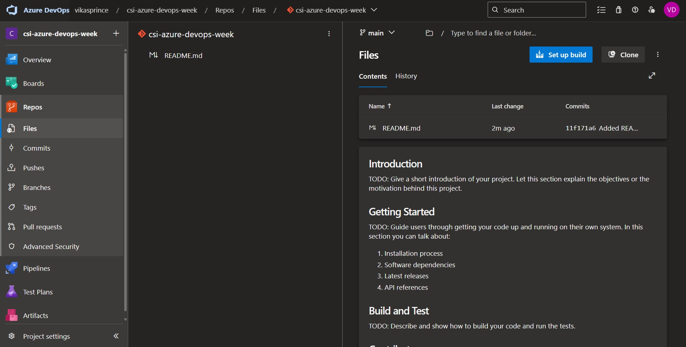
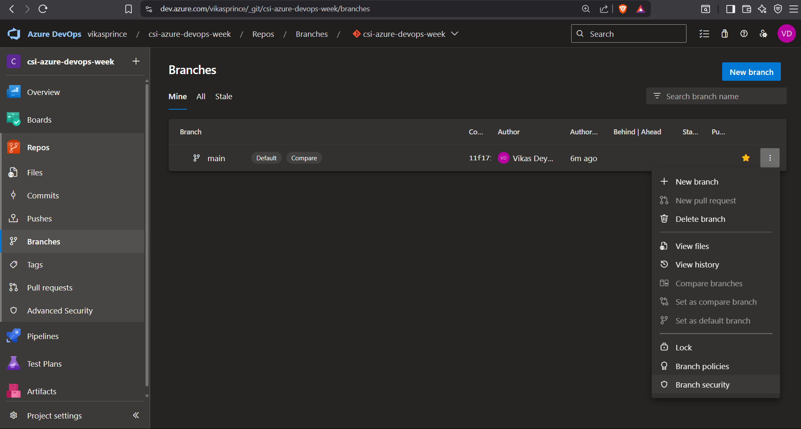
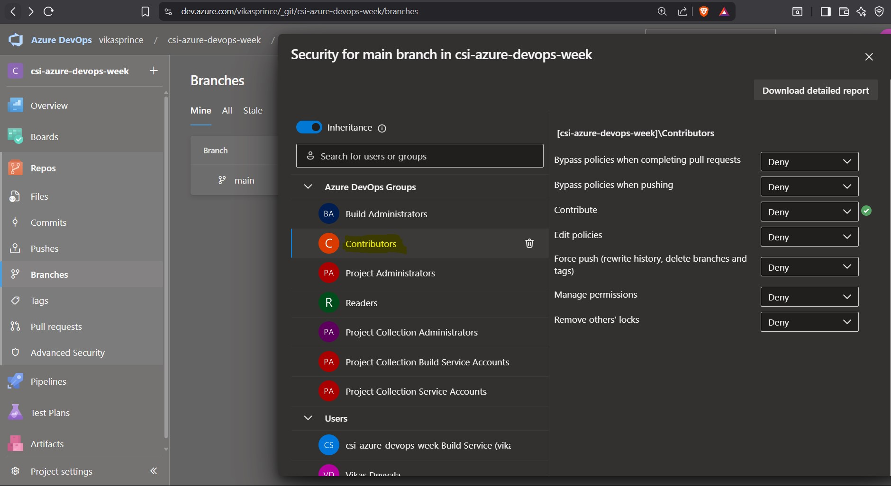
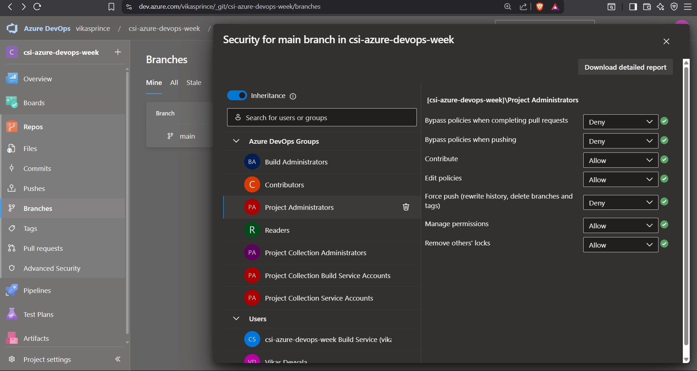

# week 7 -  Azure Repos

## Task: Restricting Access to `master` Branch – Azure DevOps Branch Policies

## Objective":

While working on the Azure DevOps project setup, I came across the need to **strictly control who can push changes to the `master` branch**. In most real-time development environments, we never allow direct access to production or protected branches unless absolutely necessary — this ensures both **code quality** and **production safety**.

So, I decided to apply a **branch security policy** where **only Project Administrators (like me)** can push to `master`, and all other users including Contributors or Developers **must go through Pull Requests (PRs)**.

---

### Initialized a Repository
First, I initialized a new repository in Azure DevOps. 

### Navigated to Repository Settings
1. Went to **Repos > Branches**.
2. Here i initialized `main` branch (in my case, the default branch).
3. Clicked on the **three dots (⋮)** next to `main` → selected **Branch Security**.

---

### 👥 Modified Permissions

#### For `Contributors` Group:
- **Contribute**: Denied
- **Force Push**: Denied
- **Manage Permissions**: Denied
- **Remove Locsk**: Denied
- **Bypass Policies**: Denied

> My intention here was to make sure that no one from the Contributor group can directly push or make changes to the `main` branch. This enforces a **Pull Request–only** workflow.

#### For `Project Administrators`:
- **Contribute**: Allowed
- **Force Push**: Denied
- **Manage Permissions**: Allowed
- **Remove Locsk**: Allowed

---

## Conclusion

By implementing these branch security settings, I've ensured that only authorized users (like Project Administrators) can push directly to the master branch, while others must go through a proper Pull Request process. This helps maintain high-quality code and prevents accidental changes to protected branches.

---

