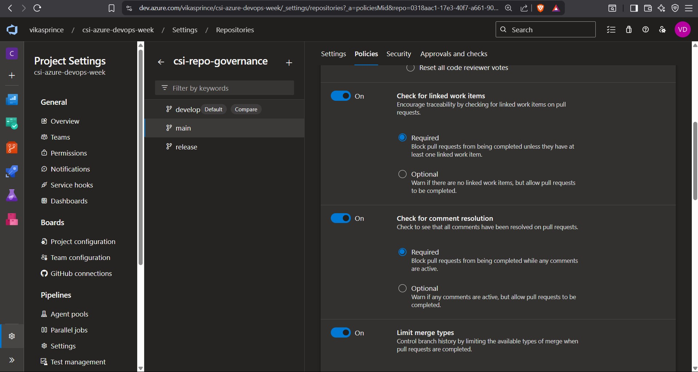
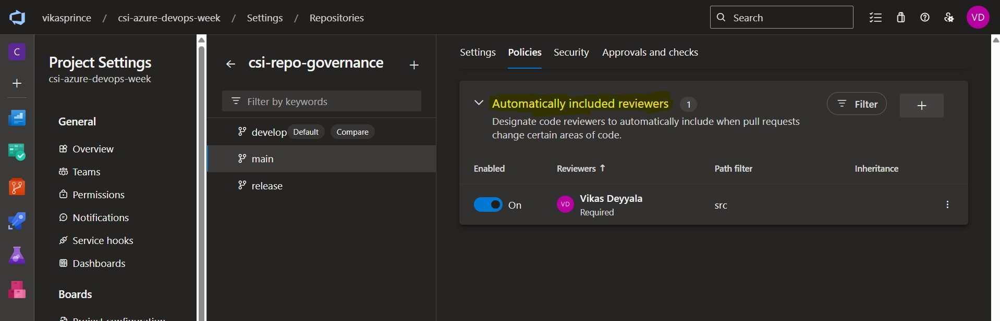
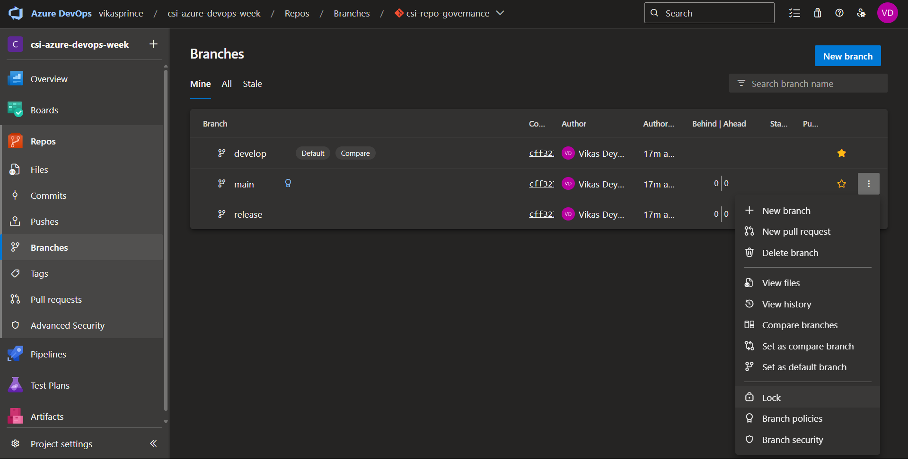

# 📘 Week 7 Tasks — Azure Repo Governance

## 📌 Objective

As part of my Week 7 tasks, I I applied **Branch Policies**, **Branch Locks**, **Branch Security Settings**, created a **Pull Request**, in Azure DevOps to bring better structure, governance, and protection to my Git workflow. This process ensures that my source code is secured, changes are peer-reviewed, and that we follow a consistent collaboration model for all contributors.

**Task 1:** Apply branch policy, Apply branch security.

**Task 2:** Apply branch security and locks.

**Task 3:** Apply a pull request.

---

## 🛠️ Initial Setup

I started by creating a new Azure DevOps Git repository and added three long-lived branches:

- `develop`
- `release`
- `main`

With the branches in place, I proceeded to apply the necessary policies, locks, filters, and permissions as described below.

---

## ✅ Task 1: Apply Branch Policies

Branch Policies are critical for ensuring code quality, enforcing peer reviews, and validating builds before any changes are merged. I configured these policies to maintain high standards for the codebase.

### 🔹 Step-by-Step: Add Branch Policies

1. **Navigate to your Azure DevOps Project**  
   First, I opened my Azure DevOps portal and selected the appropriate project where I wanted to apply the branch policies. This step ensures I’m working in the correct environment.

2. **Went to Repos → Branches**  
   From the left sidebar, I navigated to the **Repos** section and then clicked on **Branches** to see all the branches in the project. This view allows me to manage policies for any branch in the repository.

   

3. **Select the target branch (e.g., `main`, `develop`, `release`)**  
   In the list of branches, I hovered over the target branch I wanted to apply policies to (in this case, `main`). I then clicked on the **three dots (•••)** next to the branch name and selected **Branch Policies** from the dropdown. This opened the settings to configure policies for that branch.

4. **Configured Required Policies**  
   Once inside the Branch Policies page, I configured the following essential policies to ensure high code quality and workflow integrity:

   - **Require a minimum number of reviewers**: I set this policy to require at least **2 reviewers** for every pull request. This ensures that code changes are thoroughly reviewed by more than one team member before being merged.

     

   - **Check for linked work items**: I enabled this policy to require that every pull request is linked to a work item. This ensures that every code change is tied to a specific task or feature and helps in tracking progress.

   - **Check for comment resolution**: This policy was enabled to ensure that all comments on a pull request are resolved before the PR can be merged. This prevents PRs from being merged with unresolved discussions or concerns.

     

   - **Limit merge types**: I restricted the merge type to only allow **rebase merge**. This policy keeps the commit history clean and linear, which is especially useful for teams working on large codebases. Rebase merge avoids unnecessary merge commits.

     

5. **Include Auto Reviewer**  
   I enabled the option to **Automatically include reviewers** based on the service paths. This means that when certain files are changed, reviewers who are responsible for those files will automatically be added to the pull request.

   

 _Note: I applied the strictest policies to the `main` branch first, as it’s the most critical branch. After confirming that these policies were working as expected, I extended the same policies to the `release` and `develop` branches to ensure consistent code quality across all environments._

---

## ✅ Task 2: Apply Branch Locks

To ensure the integrity of critical branches and prevent any unauthorized or accidental changes, I locked the `main` branch. This is especially important to avoid overwriting key changes or introducing errors into the production-ready code.

### 🔹 Step-by-Step: Lock a Branch

1. **Navigate to Repos → Branches**  
   First, I opened the **Repos** section from the left sidebar and then clicked on **Branches** to view all available branches in the repository.

2. **Locate the branch to lock (e.g., `main`)**  
   Since `main` is the critical branch in this project, I selected it as the one to lock. It holds the production-ready code, so it's essential to keep it protected from accidental changes.

3. **Click on the three dots (•••) → Select Lock**  
   I hovered over the `main` branch and clicked on the **three dots (•••)** next to it. In the dropdown, I chose the **Lock** option to prevent any further changes to this branch unless unlocked first.

   

4. **Confirm the lock prompt**  
   After selecting **Lock**, I confirmed the prompt to finalize the action.

   🔒 The branch was now locked, and the lock icon appeared next to the branch name, indicating it's protected from unauthorized changes.

   

 _Note: Even as an admin, I can't push changes directly to a locked branch without unlocking it first. This adds an extra layer of protection, ensuring that no one including myself—accidentally commits changes to critical branches without a thorough review or approval process._

---

## ✅ Task 3: Apply Branch Security

To enhance control over who can make changes to the `main` branch and ensure that only authorized users can push updates, I configured branch-level security. This is essential to protect the `main` branch from accidental or unauthorized changes and enforce a more structured review process for updates.

### 🔹 Step-by-Step: Set Branch Security

1. **Navigate to Repos → Branches**  
   I started by opening the **Repos** section from the sidebar in the repository. Once there, I clicked on **Branches** to see a list of all the branches in the repository.

2. **Locate the `main` branch**  
   After accessing the list of branches, I found the `main` branch, which is the primary branch for production-ready code. Since this is a critical branch, I wanted to apply security settings here to make sure no one can make unauthorized or direct changes.

3. **Click on the three dots (•••) → Select Branch Security**  
   I hovered over the `main` branch and clicked on the **three dots (•••)** next to it. From the dropdown menu, I selected **Branch security** to open the security settings for this branch.

4. **Add groups or users to the security settings**  
   In the branch security settings, I added specific groups and users who should have access to the branch, including `CSI-Developers-Team`, `QA`, and other relevant teams. By doing this, only the people in these groups would be able to interact with the branch under the configured permissions.

5. **Configure permissions for each group**  
   I then adjusted the permissions for each group according to what actions they should be able to perform on the `main` branch. Here's the breakdown of the permissions I applied:

   | Permission                      | Setting I Applied for `main` |
   |----------------------------------|-----------------------------|
   | **Contribute**                   | Deny                        |
   | **Contribute to pull requests**  | Allow                       |
   | **Force push (rewrite history)** | Deny                        |
   | **Delete**                       | Deny                        |
   | **Edit policies**                | Only allowed for Admins     |

   - **Contribute**: I set this to **Deny** so that users cannot directly push changes to the `main` branch. This ensures that no one can make changes without going through a pull request.
   - **Contribute to pull requests**: I set this to **Allow** to enable contributors to make changes to the branch via pull requests (PRs). This allows updates to be reviewed before being merged.
   - **Force push (rewrite history)**: I set this to **Deny** to protect the commit history from being rewritten. This is crucial to maintain the integrity of the codebase.
   - **Delete**: I set this to **Deny** so no one can accidentally or intentionally delete the branch.
   - **Edit policies**: I restricted this permission to **Admins only**. This means only users with admin privileges can modify the branch protection rules.

6. **Save the changes**  
   Once I had configured the security settings, I clicked **Save** to apply all the changes. This ensured that the branch security was active and the settings were applied correctly.

Now, the `main` branch is protected from direct modifications, and all changes must go through a pull request for review. This setup improves the overall security of the repository and ensures that the `main` branch stays stable and protected from unauthorized changes.

---

## ✅ Task 4: Apply a Pull Request

After applying all the security and policy configurations, I created a pull request to verify that the setup was working correctly.

### 🔹 Step-by-Step: Create and Apply a Pull Request

1. **Created the `index.html` file in my local Git repository**  
   I started by creating a new `index.html` file on my local machine while working in the `develop` branch. This file was a simple change for testing purposes.

2. **Committed the changes to the local `develop` branch**  
   After making the changes to the `index.html` file, I staged the file and committed the changes to the local `develop` branch. The commit message clearly indicated the purpose of the change: "Added index.html file for testing purposes."

3. **Pushed the changes to the remote `develop` branch**  
   Once the changes were committed locally, I pushed them to the corresponding remote `develop` branch in Azure DevOps.

   

4. **Navigated to Azure DevOps to create the pull request**  
   After pushing the changes, I logged into Azure DevOps, went to the **Repos** section, and clicked on **Pull Requests**. From here, I clicked the **New Pull Request** button to begin the process.

   

5. **Selected the source and target branches for the pull request**  
   I selected the source branch as `develop` and the target branch as `release` (or `main`, depending on your workflow). This ensures that the changes in `develop` would be merged into `release`.

6. **Filled out the PR details**  
   I gave the pull request a clear title and description, explaining the changes that were made. I also linked a sample work item I had created for personal tracking purposes, to demonstrate how work items can be linked to PRs.

   

7. **Added reviewers and submitted the PR** 

   After filling out the necessary details, I added the required reviewers for the pull request. Once everything was in place, I clicked **Create** to submit the pull request. Azure DevOps automatically enforced all the branch policies, such as requiring a reviewer check, linking a work item, and running any build validation if configured.

8. **Approved and merged the PR using rebase strategy**  
   After reviewing the changes, I approved the pull request myself. Once all checks passed, I completed the PR using the **rebase merge** strategy as per the project’s policy. This ensures that the commit history remains clean and linear.

   

9. **Verified the changes in the target branch**  
   After merging the pull request, I went to the **Repos → Files** section in Azure DevOps to verify that the `index.html` file had been successfully added to the `release` branch.

   

_Note: This process also allowed me to verify that the branch policies I had configured earlier were applied correctly, including reviewer checks and build validation._

---

### Conclusion

I successfully implemented Branch Policies, Branch Locks, and Branch Security in Azure DevOps to protect critical branches like main, enforce code reviews, and ensure secure and consistent collaboration. The process was tested through a Pull Request, confirming that the policies were applied correctly and helped maintain a clean, secure workflow for the team.

---