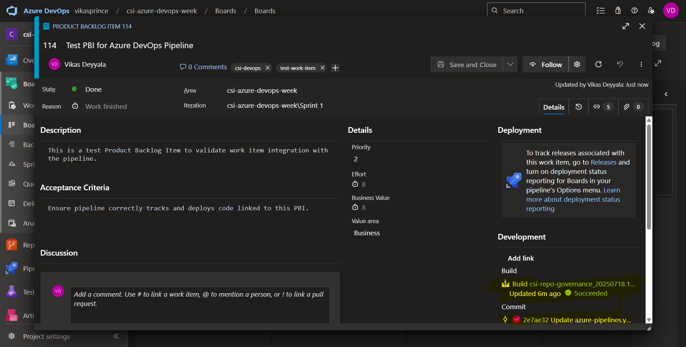

# Week 7 Extended Tasks — Azure Pipeline

## Objective

The goal of this task was to configure `branch filters`, `path filters`, `triggers`, and `gates` in Azure DevOps pipelines to streamline and control when and how deployments occur. This ensures that pipelines are only triggered for relevant changes and that deployment steps are monitored and controlled with manual approval gates. Additionally, the task involved linking a **work item** (Product Backlog Item) to the pipeline, enabling tracking of progress associated with specific work items during the pipeline execution.


---

## ✅ Task 1: Apply Branch Filters & Path Filters

Branch and path filters are used to control when a pipeline should be triggered. This ensures pipelines only run for relevant changes improving efficiency and focus.

### 🔹 Step-by-Step: Add Branch & Path Filters in a YAML Pipeline

1. **Opened my Azure DevOps project** and navigated to **Repos → Files** to edit the `azure-pipelines.yml`.

2. **Configured branch filters like this:**
```bash
   trigger:
     branches:
       include:
         - release
         - develop
       exclude:
         - main
   ```

This ensures the pipeline runs only when changes are pushed to the release or develop branches, and excludes the main branch to prevent unwanted triggers.

3. **Added path filters**:

```bash
   trigger:
     paths:
       include:
         - src/*
       exclude:
         - docs/*
   ```

This means the pipeline will only trigger when files in the `src/` folder are changed, and will ignore changes in the `docs/` folder, which isn't relevant for the build.


4. **Committed and pushed changes** to validate filtering behavior.


_Note: This setup helped me run pipelines only when specific folders or branches were affected, which reduced unnecessary builds._

---

## ✅ Task 2: Apply Triggers in Pipelines

After filtering branches and paths, I moved on to setting up automatic triggers for pipeline execution — including continuous integration and scheduled triggers.

### 🔹 Step-by-Step: Configure CI & Schedule Triggers

1. **Edited my `azure-pipelines.yml` file** to include cron triggers.

   **Applied scheduled trigger for every minute builds (testing purpose):**
   
```bash
   schedules:
     - cron: "* * * * *"
       displayName: Every Minute Build
       branches:
         include:
           - develop
       always: true
```

This cron expression `* * * * *` sets the pipeline to trigger every minute. For testing purposes, I chose to run it on the `develop` branch, and `always: true` ensures the pipeline runs even if no changes are detected.

- **Cron expression:** The `* * * * *` means "every minute" in cron syntax.
- **Display Name:** This helps label the trigger in the pipeline UI for easy reference.
- **Always:** Ensures the pipeline runs even when there’s no code change, useful for scheduled tasks.


4. **Committed the YAML and verified** that the pipeline ran correctly on pushes and by schedule.


📎 _Successfully Pipeline triggered at every minute._


---

## ✅ Task 3: Apply Gates to the Pipeline

To ensure control over deployments and prevent unauthorized or accidental releases, I configured **gates** in the pipeline. Gates are crucial checks that must be passed before deployment progresses to critical environments like `Staging` or `Production`. This helps enforce manual approval processes or time-based delays before a deployment continues.

Before setting up the gates, I first needed to **create environments** in Azure DevOps. These environments represent deployment targets like `Staging` and `Production` where the code will be deployed.

### 🔹 Step-by-Step: Create Environments

1. **Navigate to Environments**  
   First, I went to **Pipelines → Environments** in the Azure DevOps portal to access the environment management section.

2. **Create a New Environment**  
   I clicked on **"New environment"**, gave it a name like `Staging`, and added any necessary resources such as servers or clusters associated with this environment.

3. **Create Multiple Environments**  
   To align with my deployment process, I created the following environments:  
   - `Dev` for development  
   - `Staging` for testing  
   - `Prod` for production  

   

### 🔹 Step-by-Step: Configure Gates in the Pipeline

Once the environments were created, I moved on to set up **gates** in the pipeline to control the flow of deployments and ensure that proper checks are made before code is deployed to critical environments.

1. **Add Approval Gates**  
   I configured **manual approval gates** for `prod`, `Staging` and `Production` environments. This means that when the pipeline reaches these environments, it will pause, waiting for my approval before it can proceed with the deployment. 

2. **Set Up Pre-Deployment Conditions**  
   I configured pre-deployment conditions for the `dev` `Staging` and `Production` environments. These conditions ensure that the pipeline won’t deploy until the appropriate gates are satisfied. I set myself as the **approver** for `dev` `Staging` and `Production`, ensuring that I review the deployment before it proceeds.

3. **Save and Validate the Configuration**  
   After setting up the gates, I saved the pipeline definition. I then triggered a test pipeline to validate the configuration. The pipeline passed the **Build** stage successfully, and then it paused to wait for my approval at the `Dev` stage.

   


### 🔹 How the Pipeline Runs After Configuration

Now that the gates are in place, let me walk you through the deployment flow of the pipeline:

1. **Build Stage**  
   The pipeline first runs the **Build Stage**, where it performs tasks like compiling code, running tests, and preparing artifacts for deployment.

   

2. **Deploy to Dev Environment**  
   After the build completes, the pipeline proceeds to deploy the application to the `Dev` environment. Since I have configured **approval gates** for `Dev`, this step will **pause** and wait for my **manual approval** before the deployment continues.

   

  - Once it is get approved then it will proceed to deploy in dev environment

3. **Deploy to Staging**  
   Once the deployment to `Dev` succeeds, the pipeline moves to the `Staging` environment. Here, the pipeline **pauses** and waits for my **manual approval** before continuing. After I approve the deployment, it moves forward.

4. **Deploy to Prod**  
   After the deployment to `Staging` completes and I approve it, the pipeline moves to the `Production` environment. Similarly, this stage also **pauses** for manual approval. Once I approve, the deployment proceeds to production.

   

📎 _Note: Gates provide an extra layer of control over deployments. By requiring manual approvals or enforcing time delays, I ensure that deployments to sensitive environments like `Staging` and `Production` are fully controlled and authorized._

---

## ✅ Task 4: Use Work Items in Pipelines

To integrate work tracking and CI/CD processes, I configured **work items** to link directly to the pipeline. This allows us to track the progress of specific features or Product Backlog during the pipeline execution. For testing purposes, I linked the pipeline to a **Product Backlog Item (PBI)** in Azure DevOps.

To test the integration of work items with the pipeline, I created a **Product Backlog Item (PBI)** in Azure DevOps. This PBI will be used for linking to the pipeline to validate work item tracking.

### 🔹 Step-by-Step: Create a Test Product Backlog Item (PBI)

1. **Navigate to Azure DevOps**  
   I opened my Azure DevOps project in the browser.

2. **Open Boards**  
   From the left-hand menu, I clicked on **Boards** to access the work items section.

   

3. **Create New Work Item**  
   Under **Boards**, I clicked on **Backlogs**, and then I selected the **New Work Item** dropdown.

4. **Select Product Backlog Item (PBI)**  
   From the dropdown, I chose **Product Backlog Item** to create a new PBI.

5. **Fill in the PBI Details**  
   I filled out the details for the test PBI as follows:
   - **Title**: "Test PBI for Azure DevOps Pipeline"
   - **Description**: "This is a test Product Backlog Item to validate work item integration with the pipeline."
   - **Priority**: Set a priority to **Medium**.
   - **Area Path**: Chose the relevant area path for my project.
   - **Iteration Path**: Chose the iteration for which this PBI is planned.
   - **Assigned To**: I assigned it to myself.
   - **Tags**: I added relevant tags like `csi-devops` `test-work-item`
   - **Acceptance Criteria**: "Ensure pipeline correctly tracks and deploys code linked to this PBI."  

6. **Save the PBI**  
   After completing the details, I clicked on **Save and Close** to create the PBI.


7. **Get the PBI ID**  
   Once the PBI was saved, I noted the **Work Item ID** (`114`). This ID is necessary for linking the PBI to the pipeline during deployment.

### 🔹 Step-by-Step: Link Work Items to the Pipeline

After creating the **Product Backlog Item (PBI)** and obtaining its **Work Item ID** (`114`), I followed these steps to link it to the pipeline:

#### 1. **Navigate to the Pipeline**
   - I opened my Azure DevOps project in the browser.
   - From the left-hand menu, I clicked on **Pipelines** to access my CI/CD pipelines.

#### 2. **Select the Pipeline**
   - I selected the pipeline I wanted to link the PBI to.
   - I clicked on the specific pipeline where I wanted the PBI to be tracked.

#### 3. **Edit the Pipeline**
   - Once inside the pipeline view, I clicked on **Edit** to open the pipeline configuration for edited something.

#### 4. **Commit the Changes**
   - I clicked **Save** or **Commit** to finalize the changes.
   - In the commit message, I added something like: "Link Work Item PBI #114 to pipeline."

   

#### 5. **Verify the Link**
   - Once the pipeline configuration was updated, I went to the **Pipeline run** details to ensure the Work Item was linked properly.

   

   - In the **Related Work Items** section, I verified that the Product Backlog Item (PBI) with ID `114` was correctly displayed.

   

#### 6. Verify the Work Item Link in the Work Item View

To ensure that the link was properly established, I navigated to the **Work Item** (ID 114) in Azure DevOps.

1. I searched for **Work Item ID 114** via the **Boards** section or by directly searching for the Work Item ID in the search bar.
   
2. Once inside the Work Item view, I checked the **Links** tab.

3. Under the **Links** tab, I could see that the **Build pipeline** was now listed as one of the related links. This confirmed that the **Product Backlog Item (PBI)** was successfully linked to the build pipeline, and I could track the progress of the build associated with this specific work item.



---

To integrate work tracking and CI/CD processes, I linked **Product Backlog Items (PBIs)** to the pipeline for better progress tracking during execution. As part of my personal project for **Google Boutique Microservices**, I applied a typical Scrum hierarchy — **Epics** → **Features** → **PBIs** → **Tasks** — just like I would in a professional Scrum Master role.

> **Note**: I'm currently working on this project, following industry-standard practices for managing work items and pipeline integration. This reflects my hands-on experience with CI/CD processes and Agile workflows in a real-world environment.


---

### Conclusion

By implementing `branch` and `path filters`, I ensured that the pipeline only runs when specific branches or files are modified, which improved efficiency. The cron-triggered scheduled pipeline allowed for automated builds for testing purposes. Adding `manual approval gates` in the deployment stages provided more control over deployments to critical environments like `Staging` and `Production`. Linking the **work item** (Product Backlog Item) to the pipeline allowed for better tracking and traceability, ensuring that the progress of work related to the pipeline could be monitored seamlessly throughout the CI/CD process.

---