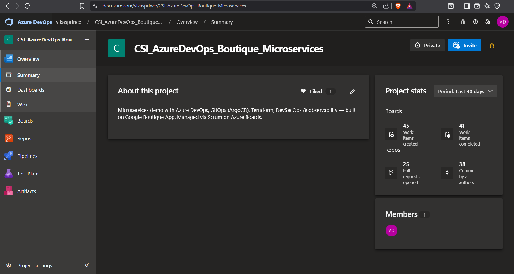
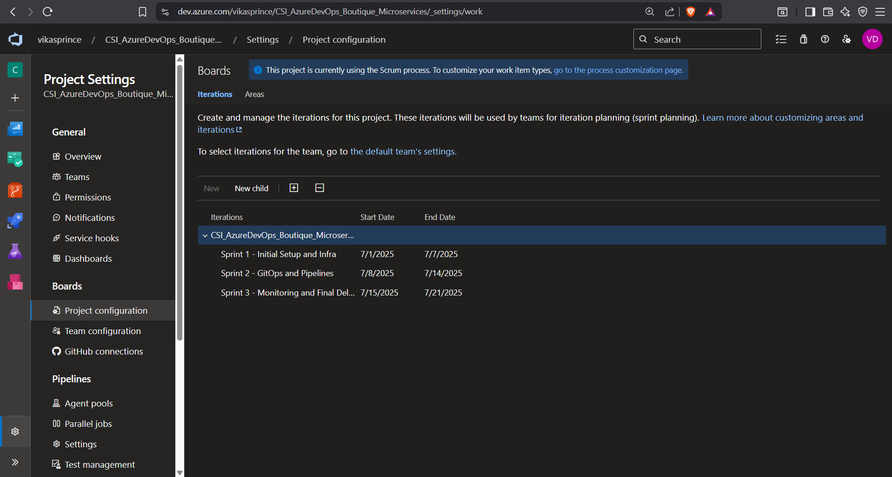
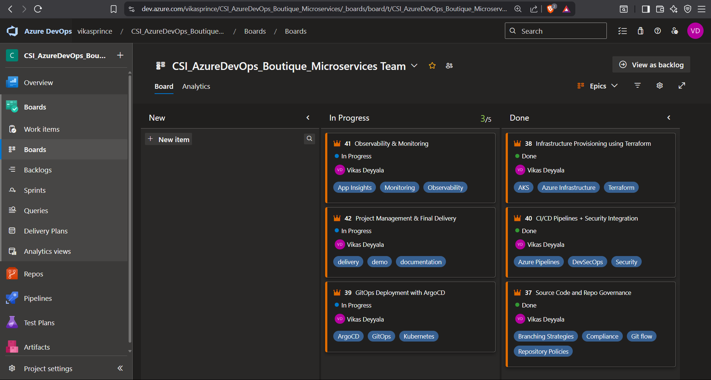
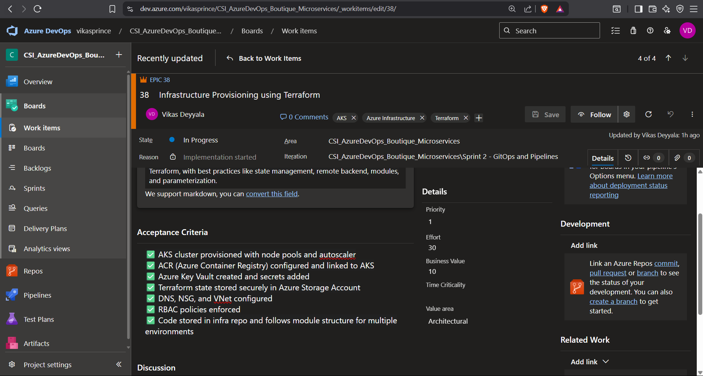
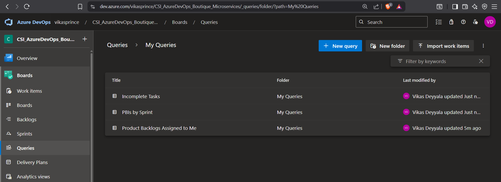
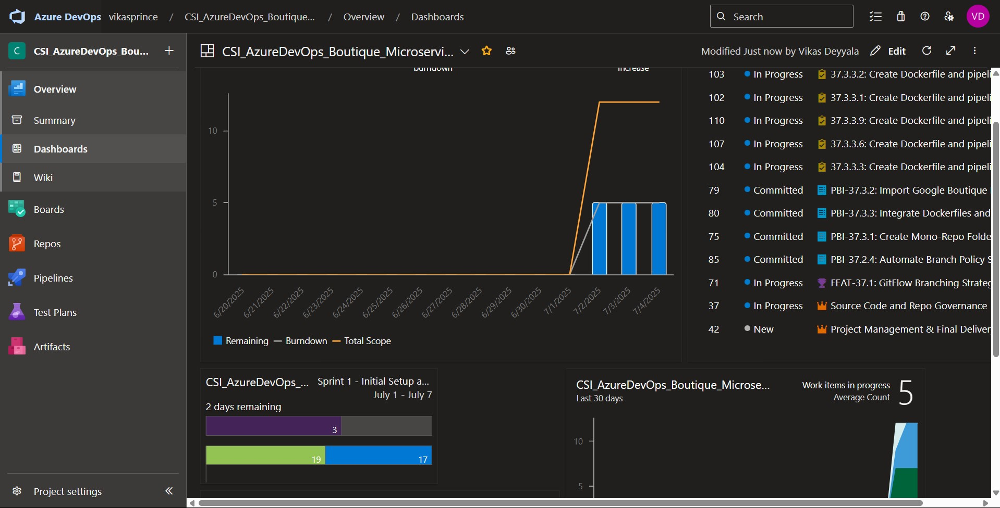
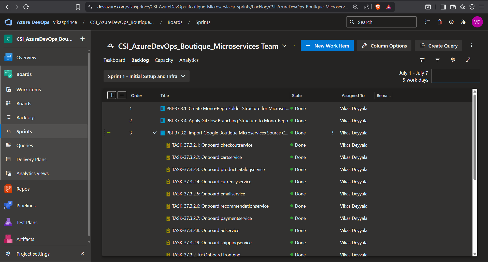

# Week 8 – Task: Managing Google Boutique Microservices Project using Azure DevOps

## Objective

For this task, I had already worked on the **Google Boutique Microservices** project, where I led the complete **Agile lifecycle management** within **Azure DevOps**. Using the **Scrum framework**, I handled everything from project planning, setting up sprints, backlog grooming, and structuring work items (**Epics → Features → PBIs → Tasks**). I also configured **dashboards** and custom work item queries, replicating how a **Scrum Master** would manage a real-world enterprise project.

This served as a practical project management simulation where I wore the hats of both **Scrum Master and Product Owner**.

---

## Step-by-Step Workflow

### Step 1: Created Azure DevOps Project

- Created a new project in Azure DevOps named: **`CSI_AzureDevOps_Boutique_Microservices`**.
- Set the process template to **Scrum** to align with real agile methodologies.
- Set proper team settings, area paths, and time zone.

---

### Step 2: Defined Project Timeline and Created Sprints

Given the total project time of **20 days**, I created **3 Sprints** in Azure DevOps under `Project Settings → Boards → Project Configuration → Iterations`.

- **Sprint 1**: Initial Infra and Repo Setup
- **Sprint 2**: GitOps and CI/CD Pipeline Implementation
- **Sprint 3**: Monitoring & Final Delivery

Each sprint had clearly defined start and end dates, aligned with the Scrum cadence.

---

### Step 3: Created Epics, Features, PBIs & Tasks

I meticulously organized the project work items in Azure Boards under:

#### 🔹 Epics (6 Total)
1. Repository Strategy & Branching
2. Infrastructure Provisioning with Terraform
3. CI/CD Pipeline
4. GitOps Deployment with ArgoCD
5. Observability & Monitoring
6. Project Management and Final Delivery

For each Epic:
- Provided full **descriptions**, **acceptance criteria**, **priority**, **effort**, **business value**
- Assigned appropriate **sprints**, **area paths**, **tags**
- Maintained link relationships: Epics → Features → PBIs → Tasks

✅ Every work item was assigned to: `vikas.deyyala23@lpu.in`

---

###  Step 4: Created Work Item Queries & Dashboards in Azure DevOps

As part of streamlining our agile project tracking and sprint visibility, I designed and configured **custom Work Item Queries** and an **interactive project dashboard** inside Azure DevOps for the **CSI AzureDevOps Boutique Microservices** workspace.

### Work Item Queries
To filter and visualize specific work items based on their purpose and state, I created multiple reusable queries under **Boards > Queries**. These help me stay organized and focused on key deliverables.

#### 1. All Epics Assigned To Me
- **Query Type**: Flat list
- **Filters**:
  - Work Item Type = Epic
  - Assigned To = @Me
  - State ≠ Closed

#### 2. PBIs by Sprint
- Filters PBIs (Product Backlog Items) grouped by the current sprint (e.g., Sprint 1, Sprint 2)
- Helps me track what’s scoped for delivery in each sprint iteration

#### 3. Incomplete Tasks
- Filters only tasks that are still **New** or **In Progress**
- Quickly identifies pending items I’m actively working on

### Dashboards

To visualize project health at a glance, I configured a dedicated **project dashboard** under the `Dashboards` section of Azure DevOps. This view includes multiple key widgets to give an immediate summary of sprint status, task flow, and project velocity.

#### Widgets Included in My Dashboard:

- **Burndown Chart**:
  - Tracks how many story points remain each day
  - Shows if we're on track with our sprint delivery

- **Sprint Progress View**:
  - Shows the number of completed vs. remaining tasks
  - Displays time left in the sprint (e.g., “2 days remaining”)

- **Work Items Summary**:
  - Shows the total number of active work items
  - Gives a breakdown of work items by status (New, In Progress, Committed)

- **Velocity View (Last 30 Days)**:
  - Reflects how many work items we’ve consistently closed across sprints
  - Useful to evaluate if we’re maintaining a healthy pace

- **Area Path Tree**:
  - Displays a hierarchy of Epics → Features → Tasks
  - Helps in understanding dependencies and the work item breakdown

> Each dashboard included widgets like charts, query results, pie visualizations for status and priority breakdowns.

---

### Step 5: Visualized Sprint-Wise Backlogs and Features

To gain better control over the scope and prioritization of deliverables within each sprint, I leveraged the **Boards → Backlogs** view in Azure DevOps.

From this view, I enabled **Epics, Features, and PBIs** hierarchy, and mapped them clearly to each sprint.

- Used **Sprint dropdown filters** to navigate between current and future iterations.
- Verified that each PBI was correctly nested under its respective Feature and Epic.
- Ensured **Work Item Priority**, **Effort**, and **Assigned To** fields were properly filled out for each backlog item.
- Adjusted **task order and ranking** inside each sprint backlog to maintain flow and prioritize high-value items.

This helped ensure that each sprint had a **clear, deliverable scope** and supported the **Scrum ceremonies** like Sprint Planning and Daily Standups.

> This view was instrumental in grooming and managing the product backlog over time and visually connecting features with real delivery goals.

---

## Conclusion

This end-to-end setup of managing the **Google Boutique Microservices** in Azure DevOps gave me practical experience in running a real-world agile project. From defining sprints, structuring backlogs, and linking Epics to Tasks, to configuring dashboards and queries, I handled the project as a **Scrum Master and Product Owner**.

---