# Week 8: Task 9 - CI/CD Pipeline for .NET App Deployment to Azure App Service

## Task Overview

In this task, I worked on creating a **CI/CD pipeline** to build a `.NET` application and deploy it to **Azure App Service** using Azure DevOps. I’m documenting the entire process here in a step-by-step manner based on what I actually performed, including the creation of the Azure Web App, setting up the service connection, building the CI/CD YAML pipeline, and finally deploying the app.

---

### Step 1: Setting Up Source Code and Pushing to Azure Repos

To begin with, I needed a sample .NET application. Since .NET 8 was already available on my system after installation, I used the following command to create a new MVC-based web application:

```bash
dotnet new mvc -n CSIDOTNETWEBAPP
```

The application was successfully generated.

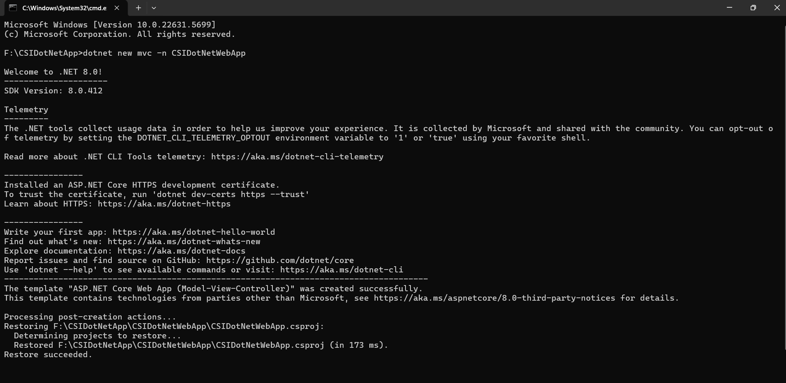

After a successful creation, I ran the application locally to ensure everything was working fine:

```bash
cd CSIDOTNETWEBAPP
dotnet run
```

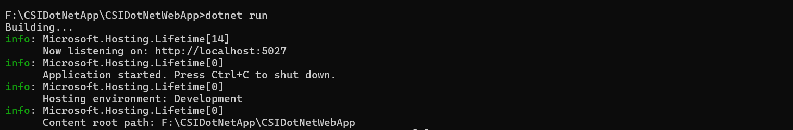

This launched the application and provided a local development URL like `https://localhost:5027`. I opened this in my browser and verified that the default MVC landing page appeared.

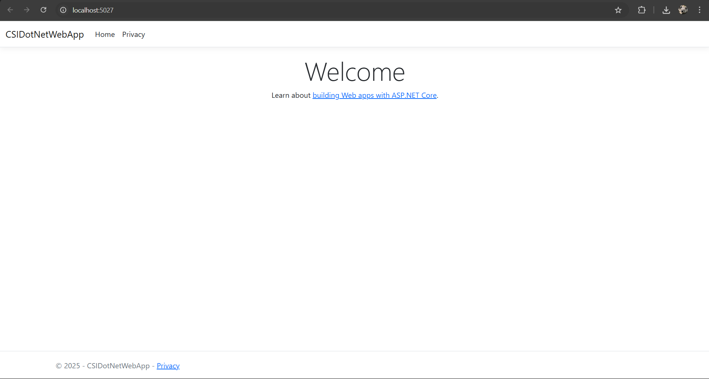

> Local application running successfully in the browser.

Once I confirmed that the app worked perfectly locally, I proceeded to push it to Azure Repos. Here’s what I did:

1. **Initialized the Git repository**:

   ```bash
   git init
   git add .
   git commit -m "feat(code): Sample Dot Net application created for the testing purpose using dotnet mvc "
   ```

   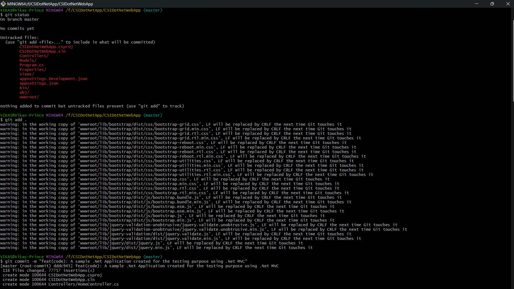

   > Git repo initialized and files committed.

2. **Added Azure Repos remote origin**:

   ```bash
   git remote add origin https://dev.azure.com/your-org-name/your-project/_git/WebApp
   git push -u origin main
   ```
   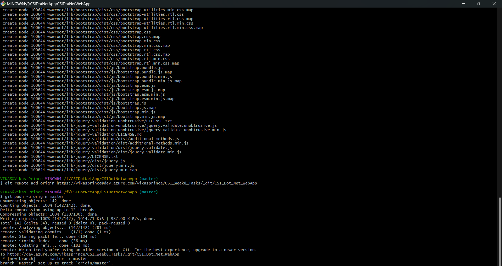

   > Remote origin added and code pushed to Azure Repos.

3. **Verified in Azure Repos UI**:
   I logged into Azure DevOps, opened the Repos tab, and confirmed that all files were successfully pushed.

    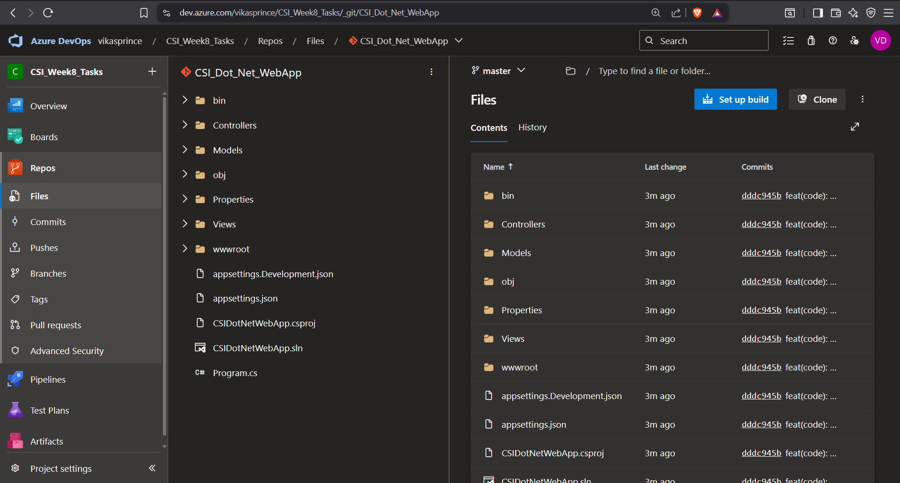

   > Code visible in Azure Repos.

---

### Step 2: Created Azure App Service

Once my source code was ready and available in Azure Repos, the next step was to provision an Azure App Service to host the .NET web application.

I went to the Azure Portal and searched for **"App Services"** in the search bar. Once the App Services blade opened, I clicked on **"+ Create"** to set up a new Web App.

Here’s what I filled out during creation:

* **Resource Group**: `rg-csi-global`
* **App Name**: `csi-dotnet-app`
* **Publish**: `Code`
* **Runtime Stack**: `.NET 8 (LTS)`
* **Operating System**: `Windows`
* **Region**: `Central India`

After reviewing all the entered information, I clicked on **"Review + create"**.

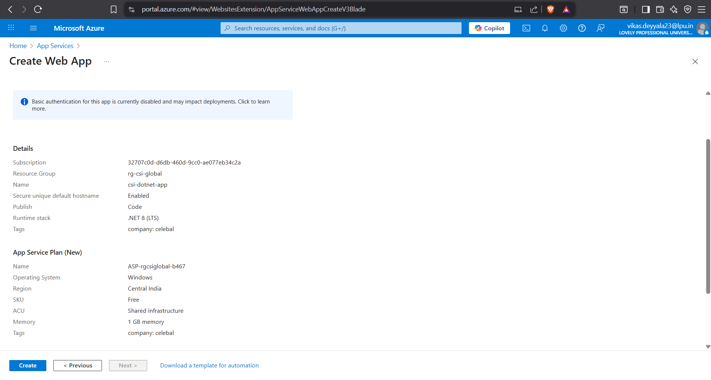

> Review screen showing all app configuration details.

Then I clicked on **"Create"**, and Azure began provisioning the App Service.

Once the deployment was complete, I received a notification and opened the resource from the portal to confirm everything was set up correctly.

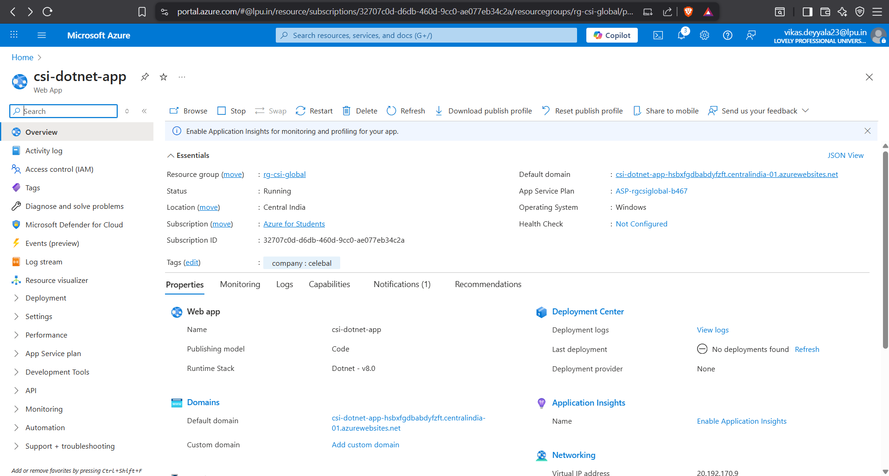

> Azure App Service successfully created and resource overview visible.

---

### Step 3: Created Service Connection in Azure DevOps

With the Azure App Service ready, the next essential step was to connect Azure DevOps with my Azure subscription so that my pipelines could deploy code directly to the App Service.

To do this, I navigated to my project in Azure DevOps and followed these steps:

1. I went to **Project Settings** (bottom left corner of the Azure DevOps portal).
2. Under the **Pipelines** section, I clicked on **Service connections**.
3. Then I clicked on **"New service connection"**.
4. I selected **Azure Resource Manager** as the type of connection, then clicked **Next**.
   
   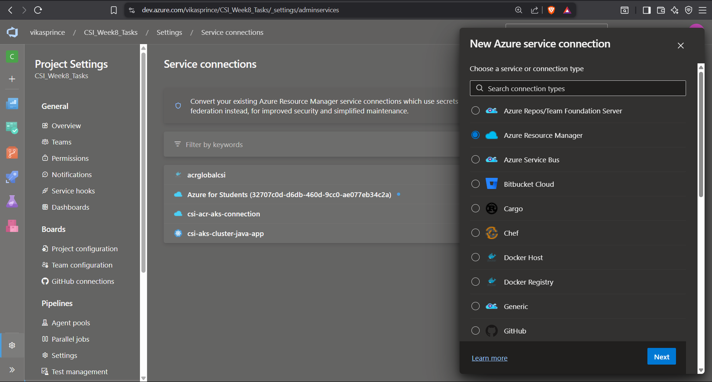

5. From the available options, I chose **Service principal (automatic)**. It automatically populated my Azure subscription and allowed me to select the correct **resource group**, which in this case was `rg-csi-global`.
6. I provided a meaningful name for the connection: `csi-dotnet-web-app`.

   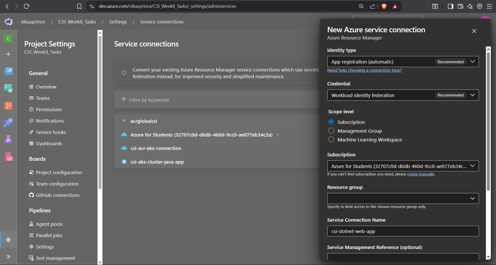

7. Finally, I clicked **Save** to create the service connection.

   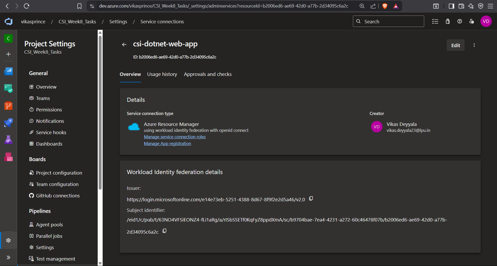

> Service connection `csi-dotnet-web-app` created successfully.

---

### Step 4: Creating CI/CD Pipeline to Build & Deploy .NET App on Azure App Service

Once everything was setup then I moved on to set up the CI/CD pipeline to automate the build and deployment process to the Azure Web App I had created earlier.

I navigated to the **Pipelines** section in my Azure DevOps project and clicked on **"New Pipeline"**. For the source code location, I selected **Azure Repos**, since my .NET application repository was already hosted there.

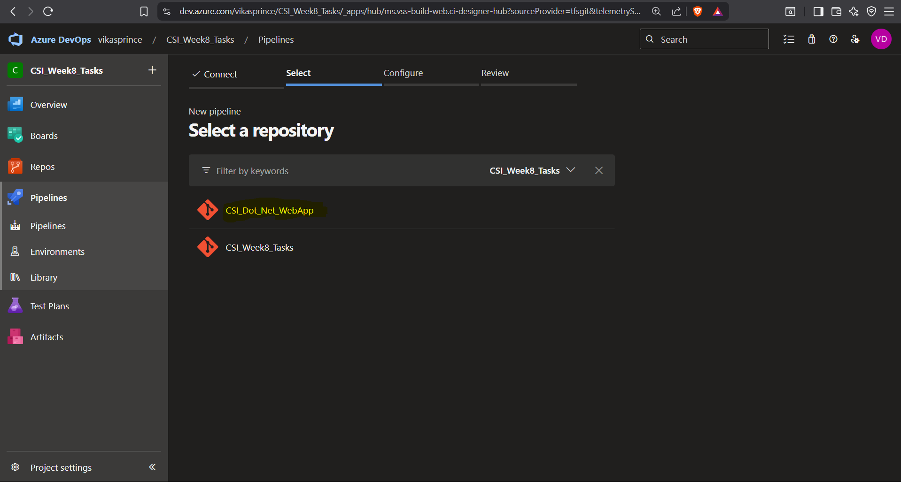

After selecting the repository, I chose to starter yaml pipeline to

- Build the .NET project using a Windows hosted agent
- Publish the build artifact
- Deploy the artifact to Azure Web App using the previously created service connection

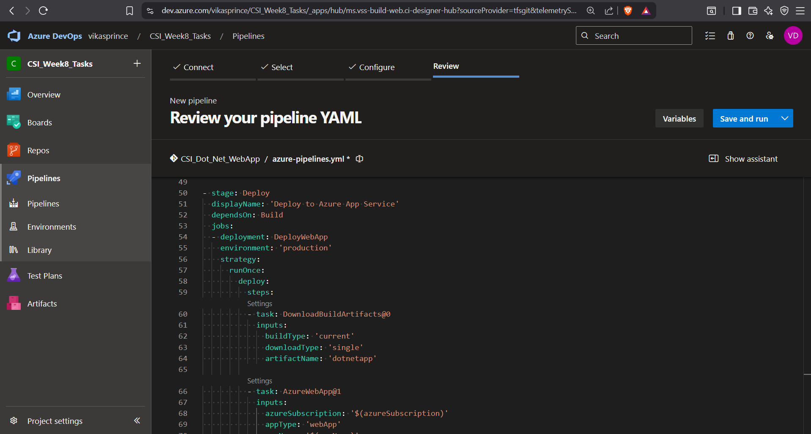

I configured the trigger as well for the pipeline to execute automatically on every push to the `master` branch. This ensures continuous integration is in place.

Once the pipeline YAML was created and committed to `master`. This triggered the pipeline execution automatically.

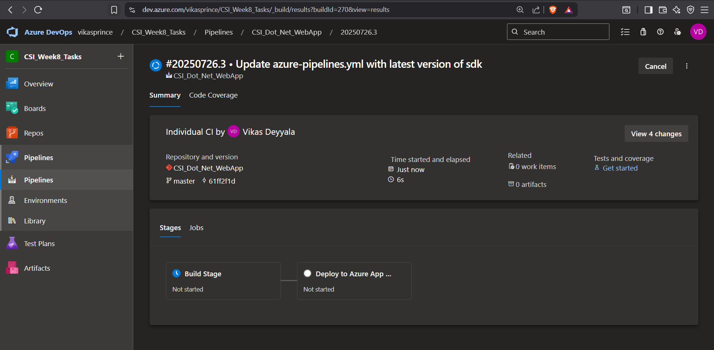

The pipeline began execution by setting up a Windows build agent and restoring dependencies. It then proceeded to build the .NET 8 project.

#### Build Stage:

* Restored all project dependencies.
* Built and published the app to the artifact directory.
* Published it as an artifact named `dotnetapp`.

After a successful build, the pipeline packaged the output into a deployable artifact.

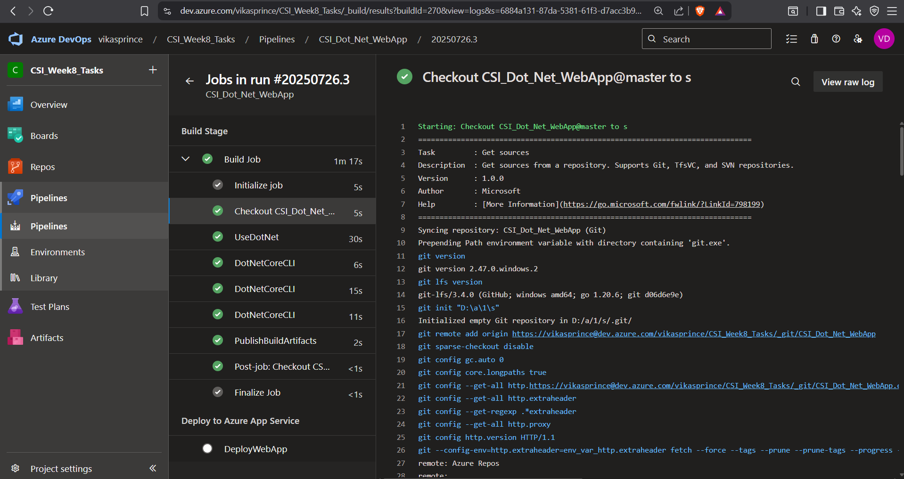

> Build stage was successful it means project build and successfully and generated artifact to deploy

Next, the pipeline moved to the **Deploy** stage. 

#### Deploy Stage:

* Downloaded the artifact from the build stage.
* Deployed it to the Azure Web App `csi-dotnet-app` using the Azure service connection.

At this point, Azure DevOps required me to **permit the service connection** to deploy to production. I clicked **“Permit”** to authorize it.

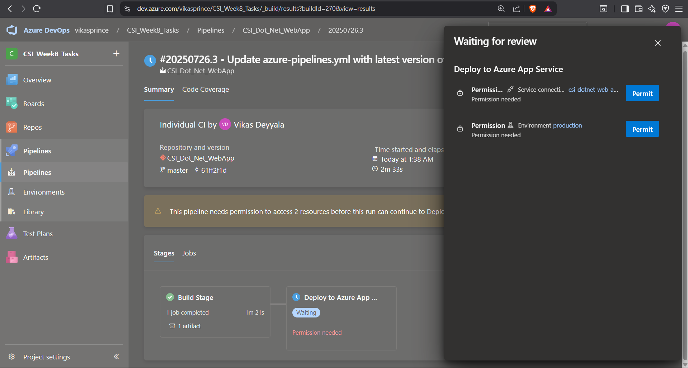

With permission granted, the deployment resumed. The pipeline pulled the artifact from the build stage and used the Azure Web App Deploy task to deploy it to the app service.

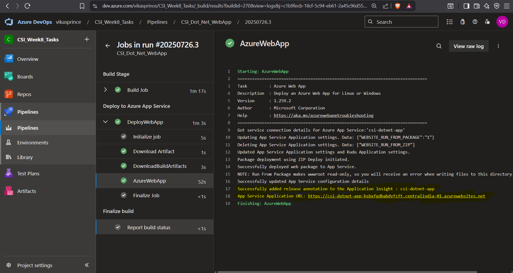

The deployment completed successfully! The app was live at: `https://csi-dotnet-app-hsbxfgdbabdyfzft.centralindia-01.azurewebsites.net/`

Additionally, **Application Insights** was automatically integrated as I had enabled it during the App Service creation.

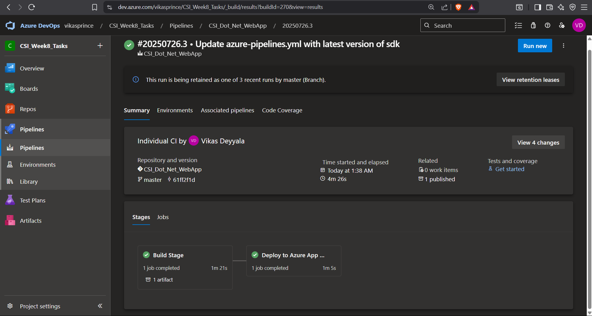

Finally, I opened the application URL in my browser to confirm the deployment. The application loaded perfectly – confirming that the CI/CD pipeline worked end-to-end and deployed the app on Azure Web App as expected.

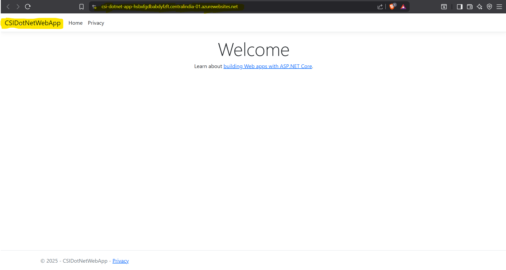


I opened the Azure Portal, went to the Web App, and clicked on the default URL. The .NET app was up and running successfully.

---

## Step 5: Post Deployment Verification — Azure Web App & Application Insights

After setting up and executing the CI/CD pipeline, I moved on to verify whether the deployment was successful and whether the application was being monitored correctly via Application Insights.

### Verified Deployment Status on Azure Web App

1. I navigated to the Azure Portal and opened the **App Service**: `csi-dotnet-app`.
2. In the **Overview** section, I went to the **Deployment Center** to check the latest deployment status.
3. The deployment triggered from Azure DevOps showed up as **successful**, indicating that the application had been deployed correctly.

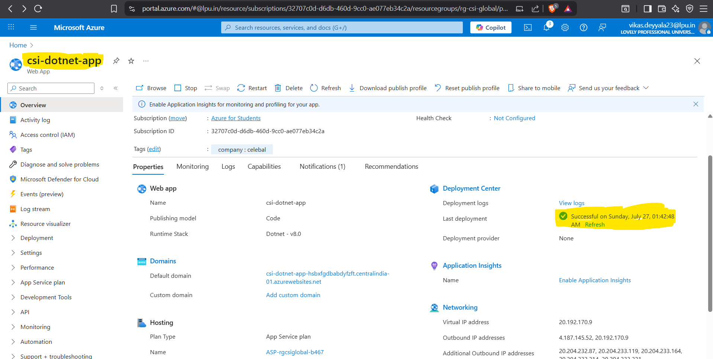

This confirmed that the .NET application was live on Azure Web App and the CI/CD pipeline was working end-to-end.

### Verified Application Insights for Application Monitoring

Since I had enabled **Application Insights** during the Web App creation, I wanted to ensure it's properly tracking performance and health metrics.

1. From the Azure Portal, I searched for **"Application Insights"**.
2. I selected the instance named `csi-dot-net` linked to the web app.
3. In the **Overview** and **Live Metrics Stream**, I validated the following metrics:
   - **Availability**
   - **Failures**
   - **Performance**
   - **Server Requests and Dependencies**

The insights and metrics were all visible and live, indicating that the monitoring setup was successfully integrated with the application.

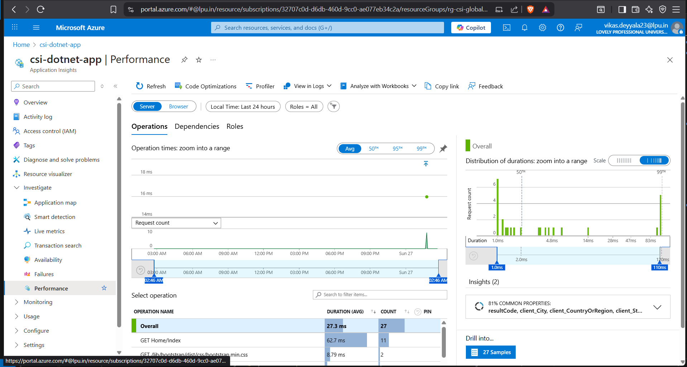

With these checks complete, I confirmed that the deployment was successful and that the app is observable through Application Insights.


---

### Conclusion

Through this task, I was able to successfully implement a complete CI/CD pipeline using Azure DevOps for a .NET MVC application. From scaffolding the project to pushing it into Azure Repos, provisioning an Azure App Service, and creating the service connection every step was tied together with a functional pipeline that builds and deploys the application automatically on every push to the `master` branch.

---