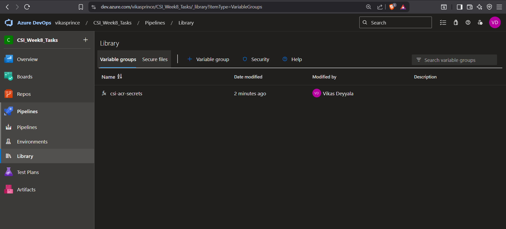
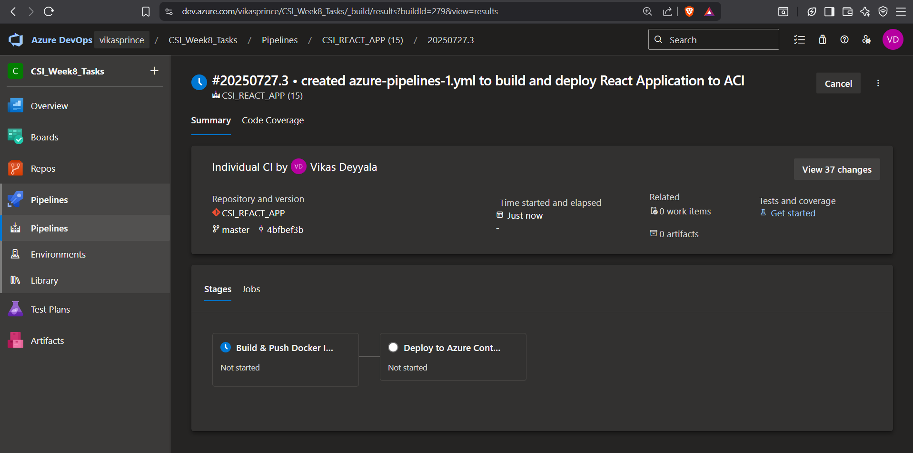
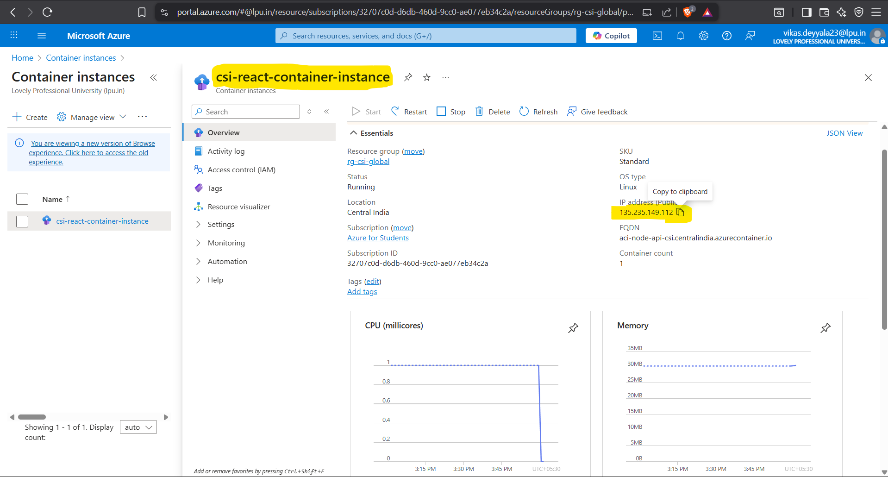

# Week 8 – Task: Create a CI/CD Pipeline to Build & Push Docker Image to ACR and Deploy to ACI

## Objective

In this task, I focused on creating a complete **CI/CD pipeline** using **Azure DevOps** that builds a **Docker image**, pushes it to **Azure Container Registry (ACR)**, and finally deploys the container to **Azure Container Instances (ACI)**.

This was a hands-on task where I got to practice how to fully automate a deployment workflow starting from code commit to container execution in Azure.

---

## Step-by-Step Workflow

### Step 1: Reused Existing Azure DevOps Repository for CI/CD Pipeline

For this task, I continued working with the **same Azure DevOps repository** that I had created earlier for deploying my React-based news web application on an **Azure Virtual Machine**.

This repository already contains the full source code of the application — a modern **ReactJS** frontend built to serve dynamic news content. Since the repository was already connected and initialized in Azure DevOps, I didn’t need to import anything new.

I simply leveraged this existing setup to build a **new CI/CD pipeline**, which builds the Docker image, pushes it to Azure Container Registry (ACR), and deploys the app on Azure Container Instances (ACI).

I continued versioning all Docker and deployment-related configuration inside this repository.

---

### Step 2: Created Azure Container Registry (ACR)

To securely store and manage the Docker image of my React-based news application, I created an **Azure Container Registry (ACR)**. This allows me to integrate it seamlessly with my CI/CD pipeline and deploy it directly to **Azure Container Instances (ACI)** later.

I followed the steps below:

1. **Navigated to Azure Portal** ➝ Searched for **"Container Registries"** ➝ Clicked **"Create"**.

2. Under the **Basics** tab, I filled in the following details:
   - **Subscription**: Selected my active Azure subscription.
   - **Resource Group**: Chosen my existing resource group (`rg-csi-global`).
   - **Registry Name**: Gave a unique name, for example, `csireactregistry`.
   - **Location**: `centralIndia`.
   - **SKU**: Chose `standard`.

3. Left other settings as default and clicked **"Review + Create"**, then hit **"Create"** after validation.

Once the ACR was provisioned, I grabbed the **login server URL** (e.g., `csireactregistry.azurecr.io`) which I used in the pipeline to tag and push my Docker image.

I also enabled **Admin user** from the **Access Keys** section of ACR to simplify authentication in the CI/CD pipeline while pushing the image.

This ACR setup acts as the central registry for storing and retrieving my application containers in a secure and controlled way.

---

### Step 3: Dockerfile Already Exists in the Repository

As I had already created a `Dockerfile` earlier for this project, I didn’t need to write a new one from scratch. The existing Dockerfile is well-structured to:

- Build a production-ready React application with `multi stage` Dockerfile.
- Serve the build using a lightweight static server (`serve`).
- Expose the appropriate port for ACI or any container runtime.

Since the Dockerfile is already committed and present at the root level of my project repository, I was good to proceed with setting up the Azure DevOps pipeline

.

This allowed me to directly jump into the CI/CD automation phase where:
- The pipeline will build the Docker image.
- Push the image to the Azure Container Registry (ACR).
- Deploy the image to Azure Container Instance (ACI) seamlessly.

> So need for extra manual effort at this step everything was ready for automation.

---

### Step 4: Service Connection Setup in Azure DevOps

To securely deploy my containerized React application using Azure DevOps, I needed to configure **two service connections**:

#### 1️. Docker Registry Service Connection

I created a **Docker Registry** service connection to allow Azure DevOps to authenticate and push images to my **Azure Container Registry (ACR)**.

- Selected **Docker Registry** as the connection type
- Provided the following details:
  - **Registry Type**: Azure Container Registry
  - **ACR username**: acrreactregistry
  - **ACR Password**: `Azure ACR password`
  - **Service Connection Name**: `acr-docker-connection`

- Clicked **Verify and Save** to successfully establish the connection

#### 2️. Azure Resource Manager (ARM) Service Connection

Instead of creating a new ARM connection, I **reused the existing Azure Resource Manager service connection** that I had already configured earlier for my `.NET` deployment project.

By setting up these two service connections:
- Azure DevOps can **push Docker images** to ACR using the Docker Registry connection
- It can also **deploy containers** to Azure Container Instances (ACI) using the ARM service connection

This ensures secure, credentialed, and seamless end-to-end container deployment within the Azure ecosystem.

---

### Step 5: Secrets Configuration in Azure DevOps Library

To securely authenticate with my Azure Container Registry (ACR) during the pipeline execution, I added the necessary credentials as **secret variables** under the Azure DevOps **Library** section.

I navigated to:

**Pipelines ➝ Library ➝ + Variable Group**

Here’s what I did:

1. Created a new variable group named `csi-acr-secrets`.
2. Retrieved the **ACR admin username** and **password** from the Azure Portal:
   - Opened ACR ➝ Access Keys ➝ Enabled Admin User ➝ Copied `Username` and `Password`.
3. Added these values as **secret variables**:
   - `ACR_USERNAME`
   - `ACR_PASSWORD`
4. Although Azure DevOps provides a “Keep this value secret” option to mask and secure sensitive values during pipeline execution, I chose not to enable it for this demo purpose to simplify the setup and debugging process.

After, I'll link this variable group to the pipeline so that the CI/CD job can authenticate with ACR and push the Docker image securely.

--- 

### Step 6: Creating CI/CD Pipeline to Build & Deploy React App to Azure Container Instance via ACR

After setting up the Azure Container Registry, Dockerfile, and service connection, my next step was to define and configure a CI/CD pipeline in Azure DevOps. The goal was to automate the complete process — build the Docker image for the React app, push it to ACR, and deploy the container image to Azure Container Instance (ACI).

I navigated to the **Pipelines** section in Azure DevOps and clicked on **New Pipeline** to get started.

1. Selected **Azure Repos Git** as the code source because my `csi-react-app` project was already available there.
2. Chose the same repository: `csi-react-app`.
3. Selected **YAML** as the configuration approach to define the CI/CD flow as code.

> Once this was selected, Azure DevOps opened up the in-browser YAML editor with a sample starter pipeline. I deleted the default and started fresh by defining my own pipeline logic for this React + ACR + ACI use case.

In the above script:

* ACR credentials were securely stored in pipeline secrets: `ACR_USERNAME`, `ACR_PASSWORD`

---

### Step 7: Triggering the CI/CD Pipeline

After committing the final pipeline YAML file to the `master` branch, the deployment process was automatically initiated through Azure DevOps CI/CD pipeline.

This step executed an end-to-end container deployment workflow—from building the Docker image to deploying the container to Azure Container Instances (ACI).

#### Pipeline Triggered Automatically

Once the code was pushed to the `master` branch, Azure DevOps detected the change and **triggered the pipeline automatically** as per the trigger condition defined in the YAML.

#### Build Stage: Docker Image Built Successfully

The first stage of the pipeline involved **building the Docker image** using the specified Dockerfile.

- Used the `docker build` command within the pipeline agent
- Tagged the image with `latest` and the Git commit hash for traceability
- Confirmed build success with green status in the logs

#### Push Stage: Docker Image Pushed to ACR

Once the image was built, the pipeline pushed it to **Azure Container Registry (ACR)** using the Docker Registry service connection configured earlier.

#### Cleanup & Deployment Stage: ACI Refreshed with New Image

Before deploying, the pipeline **checked for any existing Azure Container Instance (ACI)** with the same name and **deleted it** to avoid conflicts.

Then, a **new ACI instance** was created using the latest image pulled from ACR.

- Container instance was created in the specified resource group and location
- Used environment variables and DNS labels as per the YAML configuration

---

### Step 8: Post-Deployment Verification: Container Instance Verified

After the deployment completed, I navigated to the **Azure Portal → Container Instances** section to verify the deployment.

- Found the newly created ACI instance
- Copied the **public IP address** provided under the container's DNS settings
- Accessed the web application via browser

Finally, I copied the **public IP address** of the container instance, opened it in a browser at port **3000**, and was able to see my Java app UI running just like expected.

---

### Conclusion

This task helped me understand how to automate the full process of building and deploying a React app using Azure DevOps. I set up a pipeline that builds a Docker image, pushes it to Azure Container Registry, and deploys it to Azure Container Instances. It was a great hands-on experience that showed me how CI/CD works in real-world projects and how everything connects from code to deployment.

---