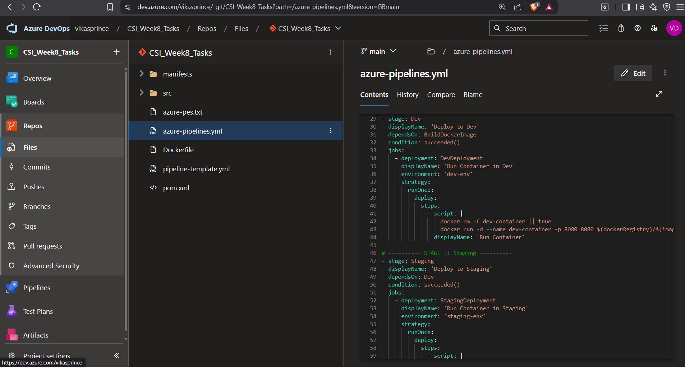
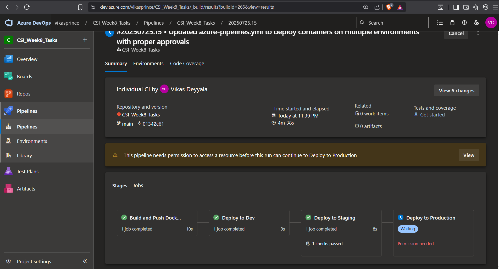

# Week 8 – Task 6:  Apply Pre & Post Deployment Approvers in Multi-Stage YAML Pipeline

## Overview

For this task, I explored how to configure **pre and post-deployment approvals** within **YAML-based multi-stage deployment pipelines** in Azure DevOps. The goal was to simulate real-world gated environments where each promotion (Dev → Staging → Prod) requires manual validation and approval.

Unlike traditional UI-based Release Pipelines (now deprecated), I implemented this using modern **YAML pipelines** and linked them with **environments** to enable approval workflows.

---

### Step 1: Creating Environments (Dev, Staging, Prod)

To begin setting up my deployment pipeline, I first created separate environments in Azure DevOps to represent each stage of the release lifecycle. These environments help isolate deployments and enforce manual validations before promoting changes forward.

So, I navigated to **Pipelines → Environments** inside my Azure DevOps project.

From there, I created three environments:

- `dev-env`
- `staging-env`
- `prod-env`

For each of these environments, I took the following steps:

1. **Added the Self-Hosted Agent** as the deployment target. Since my pipeline runs on a custom self-hosted agent, I ensured that each environment was configured to use it correctly.
2. **Enabled Pre-deployment Approvals**: Inside each environment's settings, I enabled pre-deployment approval and added myself as the approver. This ensures that no deployment occurs automatically without my manual validation.

3. **Enabled Post-deployment Approvals**: Similarly, I enabled post-deployment approvals and assigned myself again. This step acts as an additional safeguard to verify deployment success before the pipeline proceeds to the next environment.

4. Saved the changes for all three environments.

This setup gave me fine-grained control over how and when my Docker container is deployed across Dev, Staging, and Production. It's particularly important for production deployments, where careful review is critical.

With environments and approvals in place, I was ready to move on to building the multi-stage YAML pipeline.

---

### Step 2: Writing the Multi-Stage YAML Pipeline

Next, I created a new YAML pipeline under **Pipelines → New Pipeline** and selected the repository where my Dockerfile and app code were located.

I wrote a multi-stage pipeline with the following logic:

### 🔹 Stage 1 - Dev:
Builds and runs the container on the self-hosted agent.

### 🔹 Stage 2 - Staging:
Waits for my approval, then deploys the same container to staging.

### 🔹 Stage 3 - Prod:
Waits for another manual approval before deploying to production.

Each stage used the `docker run` command to launch a simple container on the agent, instead of deploying to Kubernetes.

---

### Step 3: Running the Pipeline — Approvals in Action

Once I committed the YAML file and pushed it to the `main` branch, the pipeline was automatically triggered (thanks to the `trigger` configuration).

#### Stage 1: Dev Environment Deployment

- The pipeline first executed the **Dev** stage automatically with no manual intervention.
- It built the Docker image and pushed it to the **Azure Container Registry (ACR)** using the self-hosted agent.
- From there, the Docker container was launched directly on the **Dev environment** using the image pulled from ACR.

#### Stage 2: Staging Deployment

- After Dev deployment succeeded, the pipeline **paused and awaited approval** before proceeding to the Staging environment.

#### Stage 3: Production Deployment 

- After successful staging validation, I manually approved the pipeline to trigger the **Production deployment**.
- The same container image was deployed to the **Production environment** using the same self-hosted agent.

This flow ensured complete control at every step, allowing me to validate changes before promoting them to higher environments.

#### Post-Deployment Verification

- **Job Status Check in Azure DevOps**
I navigated to the pipeline run details and reviewed the status of each environment stage — Dev, Staging, and Production. Each stage showed a green check mark, confirming that the jobs ran and completed successfully without any errors.

- **Container Check on Self-Hosted Agent**

I  used the Docker CLI (docker ps) to inspect the containers. I confirmed that the latest image was running as expected in all the environments, ensuring that the deployments were applied properly.

Finally, I opened the application URL in my web browser. The app loaded successfully.

---

### Conclusion

Through this task, I gained hands-on experience implementing pre and post-deployment approvals in a multi-stage YAML pipeline using Azure DevOps Environments. This approach closely mirrors real-world enterprise scenarios where every deployment needs to be reviewed and verified before moving forward.

---