# Week 8 - Task 7: CI/CD Pipeline — Build & Deploy Java App to AKS via ACR

## Overview

This documentation outlines the full setup process I followed to implement an end-to-end CI/CD pipeline for a **Java-based Spring Boot application** using **Azure DevOps**, **Azure Container Registry (ACR)**, and **Azure Kubernetes Service (AKS)**. The pipeline automates:

* Building the Java app with Maven
* Creating a Docker image
* Pushing the image to ACR
* Deploying the app to AKS using Kubernetes manifests

This approach ensures that every code change made to the `main` branch is automatically built, containerized, and deployed to production in a streamlined and repeatable way.

---

### Prerequisites (Already Created)

Before starting the pipeline configuration, I had the following resources ready:

- A Java Application (Spring Boot app with `pom.xml`)
- An Azure Kubernetes Service (AKS) cluster

  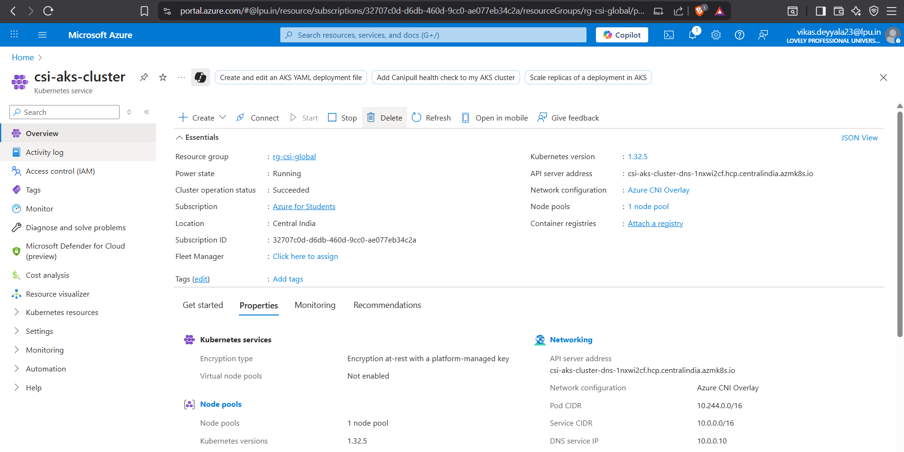
  
- An Azure Container Registry (ACR) to push Docker images

  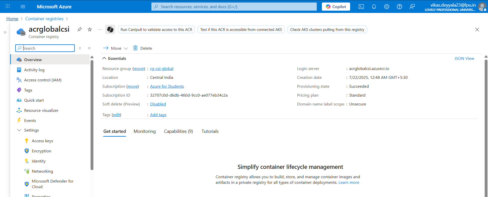

---

## CI/CD Pipeline Configuration (Step-by-Step)

### Step 1: Create an Azure DevOps Project

I started by creating a new project in Azure DevOps where I would store my source code, YAML pipeline file, and manage the build/deploy process.

- Visited [dev.azure.com](https://dev.azure.com)
- Clicked on **New Project**

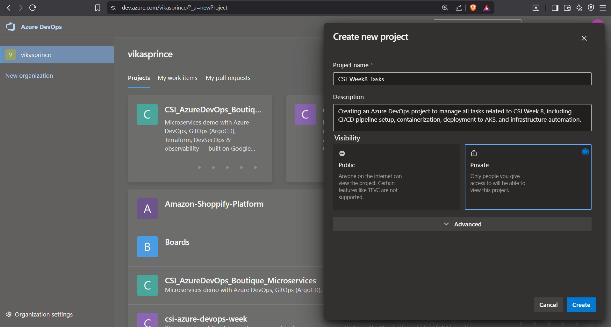

- Gave it a name, set it to **Private**, and clicked **Create**

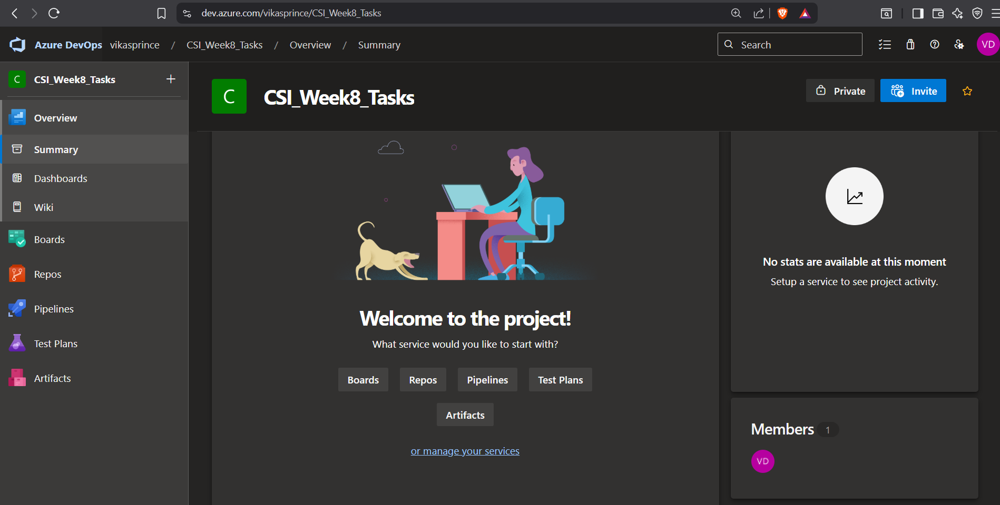


---

### Step 2: Initialized a Repository for Java Application

Instead of cloning an empty Azure DevOps repository, I already had the Java Spring Boot application on my local system. So, I added the Azure DevOps repo as a remote origin to my existing Git project and pushed the code directly. Here's how I did it:

#### Added Azure DevOps as a Remote Origin

Then, I copied the clone URL of my Azure DevOps repository from the portal:

- Navigated to Repos → Clone
- Selected HTTPS and copied the URL `https://dev.azure.com/{org}/{project}/_git/{repo-name}`

I added it as the remote origin in my existing local repo:

```bash
git remote add origin https://dev.azure.com/{org}/{project}/_git/{repo-name}
```

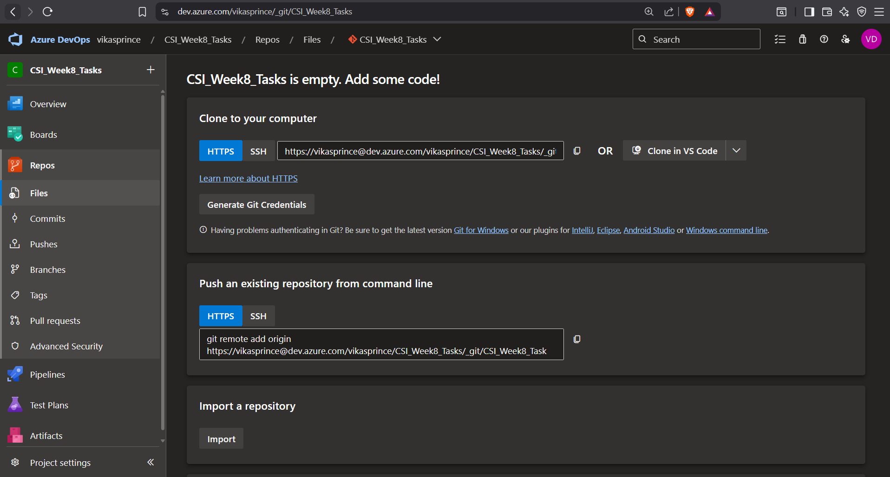

#### Committed and Pushed the Code

After ensuring all project files were ready, I staged and committed the changes:

```bash
git add .
git commit -m "feat(java-app): Added Source code for Java application with Dockerfile to build docker iamge"
```

Then pushed the code to the main branch of the Azure repo:

```bash
git push -u origin main
```

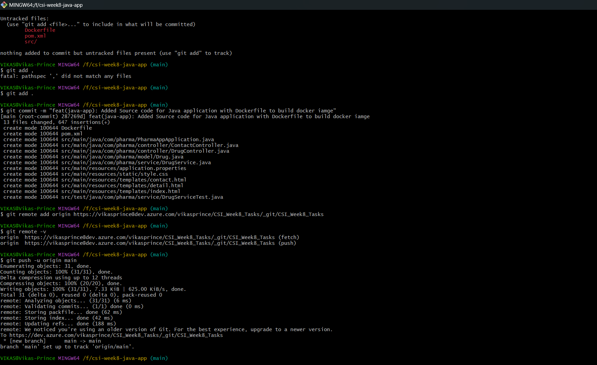

#### Verified in Azure DevOps
After pushing, I refreshed the Azure Repos page and could see my full project:

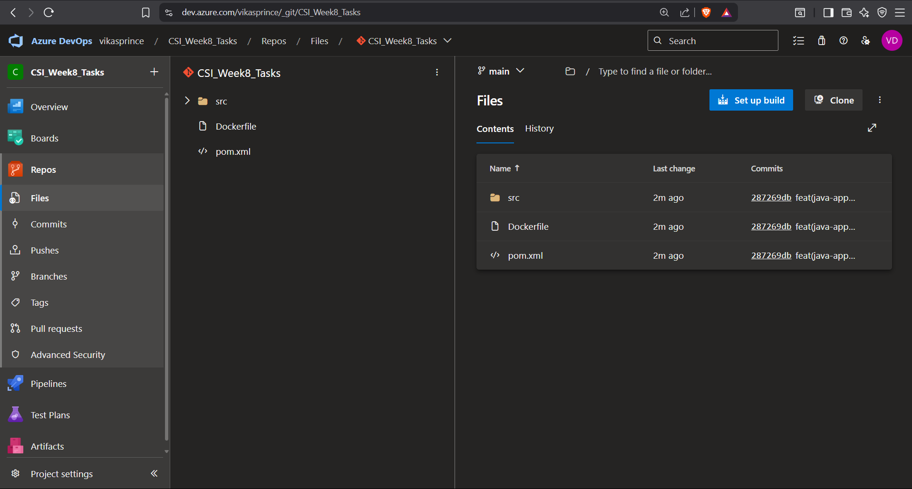

Now the application code was fully version-controlled in Azure DevOps and ready for setting up CI/CD pipelines in the next step.

---

### Step 3: Add Dockerfile to the Java Project

Next, I created a `Dockerfile` in the root directory of my Java project. This file defines how my Spring Boot app will be built and containerized.

**Dockerfile**
```bash
FROM maven:3.8.4-openjdk-17-slim AS build
WORKDIR /app
COPY pom.xml .
COPY src ./src
RUN mvn clean package -DskipTests

FROM openjdk:17-jdk-slim
WORKDIR /app
COPY --from=build /app/target/*.jar app.jar
ENTRYPOINT ["java", "-jar", "app.jar"]
```
This ensures a clean, minimal final image with only the compiled JAR.

---

### Step 4: Create the Azure DevOps Pipeline for CI/CD

After creating the `Dockerfile`, the next step was to set up the **Azure DevOps pipeline** to automate the CI/CD process for building the Docker image, pushing it to Azure Container Registry (ACR), and deploying the Java app to AKS.

To begin the pipeline setup, I went to **Azure DevOps** and followed these steps:

1. **Navigate to Azure Pipelines**: 
   - On the Azure DevOps portal, I clicked on **Pipelines** and selected **Create Pipeline**.

   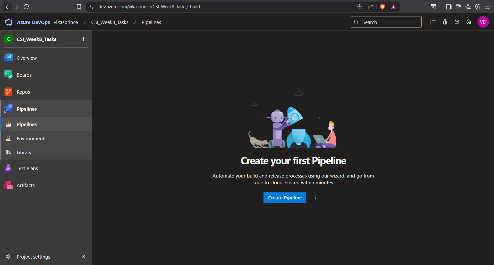

2. **Select the Repository**:
   - I chose my repository `csi_week8_tasks` that contained the Spring Boot application and the newly added Dockerfile.

   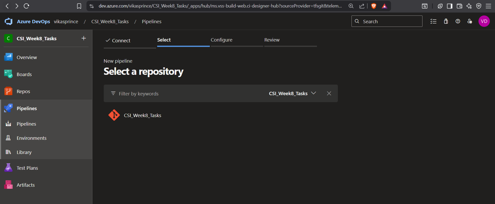

3. **Choose the Pipeline Source**:
   - I selected **YAML** as the pipeline configuration, as we wanted to create a customizable YAML file for full control.

4. **Configure the Pipeline with AKS Deployment**:
   - I selected **Azure Kubernetes Service (AKS)** as the deployment target.
   - For **Azure subscription**, I chose my existing Azure subscription linked to the AKS cluster.
   - For **Cluster**, I selected the **AKS cluster** that I had previously set up.
   - Then, I provided the **resource group** associated with AKS.
   - I also selected **namespace `java-app`** for the deployment, ensuring that all resources are deployed under this namespace. This namespace is the one we’ll use to monitor our application in AKS.

   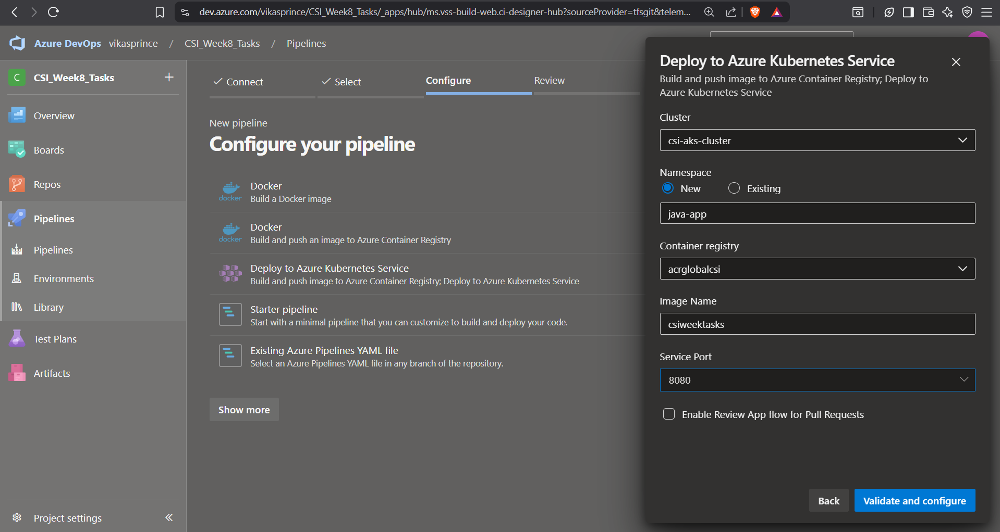

5. **Save and Generate the Full Pipeline YAML**:
   - Once I clicked **Save**, Azure DevOps automatically generated the full pipeline script for me. This script includes all the necessary tasks to build the Docker image, push it to ACR, and deploy the app to AKS using Kubernetes manifests.

   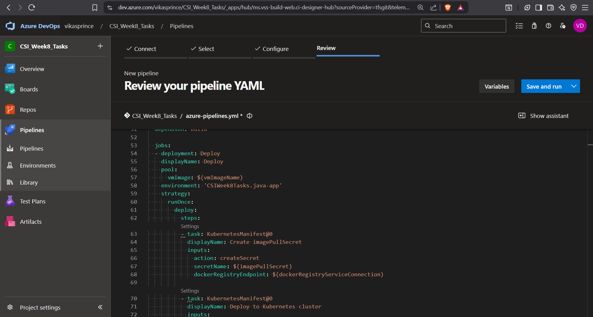
   
   The best part here was that **Azure DevOps automatically generated Kubernetes manifests** for me! These include:
   - **Deployment.yaml** (which defines how to deploy the app)
   - **Service.yaml** (which exposes the app via a LoadBalancer)

   I could verify this by navigating to **Azure Repos** under my project. In the **`manifest` folder**, I saw that both `deployment.yaml` and `service.yaml` files were created automatically by the pipeline. 

   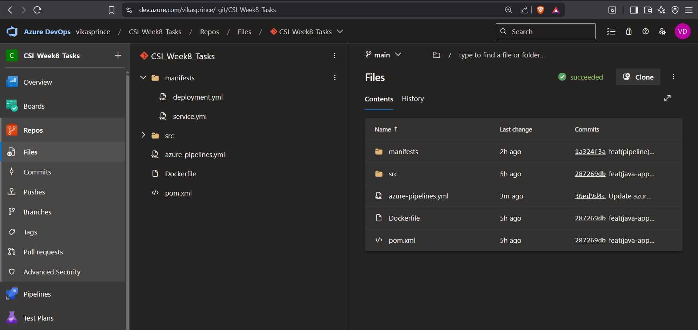

---

### Step 5: Set the Trigger for Continuous Integration

I also configured the pipeline **trigger** to ensure that **any changes to the `main` branch** would automatically trigger the pipeline. This means that every time I push changes to the main branch, the entire pipeline will run—automatically building the Docker image, pushing it to ACR, and deploying it to AKS without any manual intervention.

Here’s how I did it:
- In the pipeline configuration YAML, I specified the **trigger** section as follows:

```bash
trigger:
  branches:
    include:
      - main
```

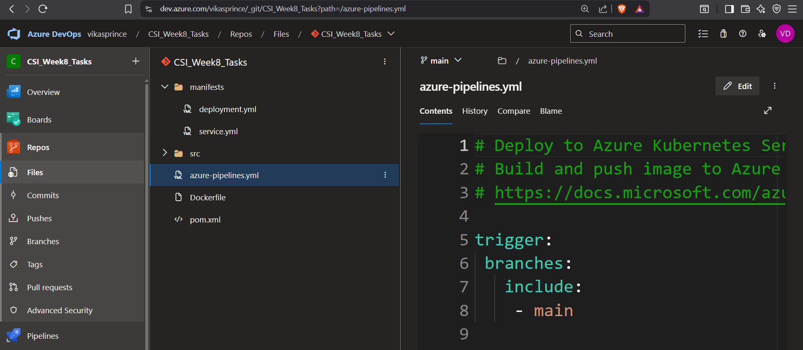

This ensures that any change pushed to the `main` branch will initiate the pipeline.


### Step 6: Running the Pipeline and Verifying the Build & Deployment

Once the pipeline was saved and configured, I decided to verify everything by making a change to the main branch. As soon as I committed the change, I went to Azure Pipelines, and I could see that the pipeline was automatically triggered.

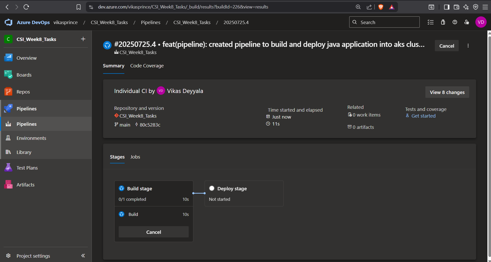

#### Build and Push Stage:
The Build stage ran first. It successfully built the Docker image and tagged it with the build ID. Then, it pushed the image to Azure Container Registry (ACR).  
I could verify this in the Azure Pipeline the `docker build` and `docker push` commands running successfully.

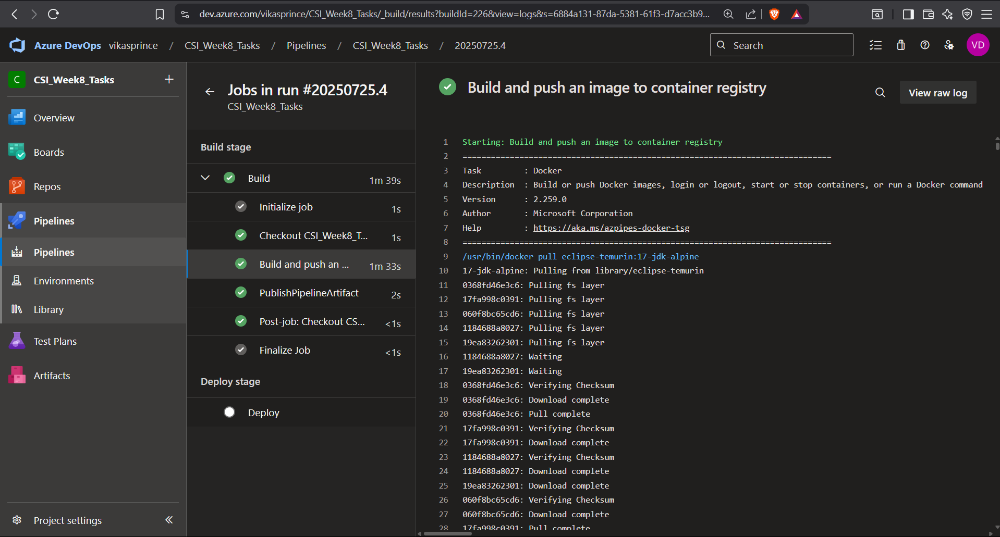

The Docker image was successfully pushed to ACR, and the pipeline moved on to the next stage—Deployment.

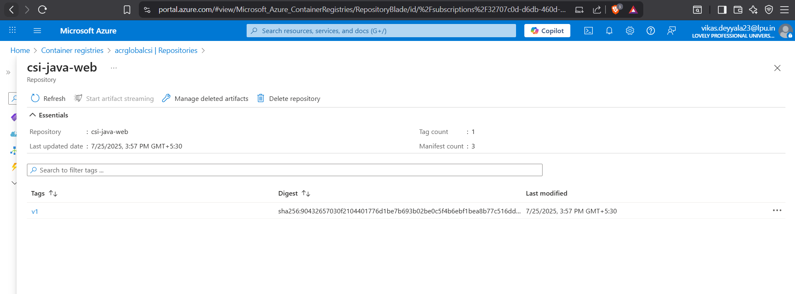


#### Deploy Stage:
The Deploy stage kicked off automatically. The pipeline used the generated Kubernetes manifests (which were part of the YAML pipeline) to deploy the app to AKS.  
It applied the `deployment.yaml` and `service.yaml` files to the AKS cluster, ensuring that the Java app was deployed to the `java-app` namespace.

---

### Step 7: Verifying Deployment on AKS

To make sure everything was deployed successfully, I opened my terminal and used `kubectl` to check the deployment status:

#### Check the Namespace:
First, I checked if the namespace was created in my AKS cluster:

```bash
kubectl get ns 
```

I could see the `java-app` namespace listed, which confirmed that the pipeline had created it as part of the deployment.

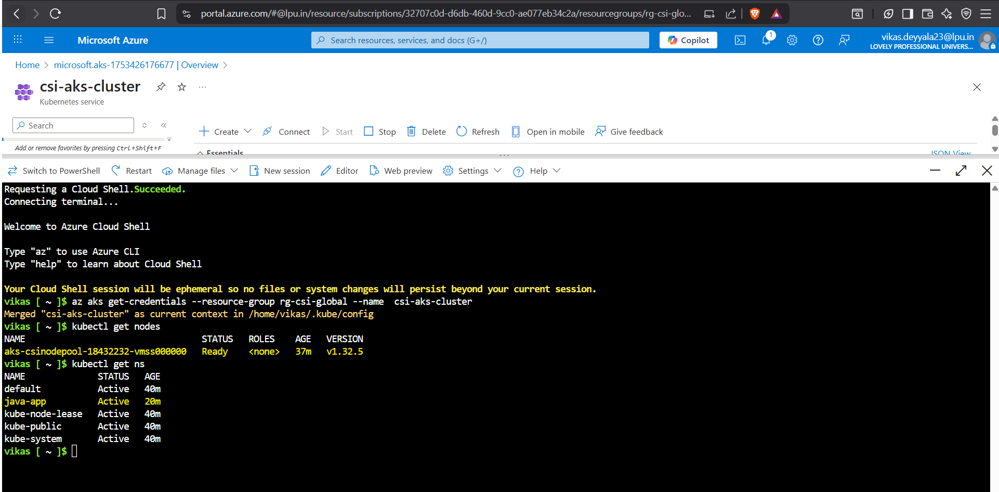

I saw the external IP assigned to the service. I opened the IP in my browser and could access the Spring Boot application running on AKS!

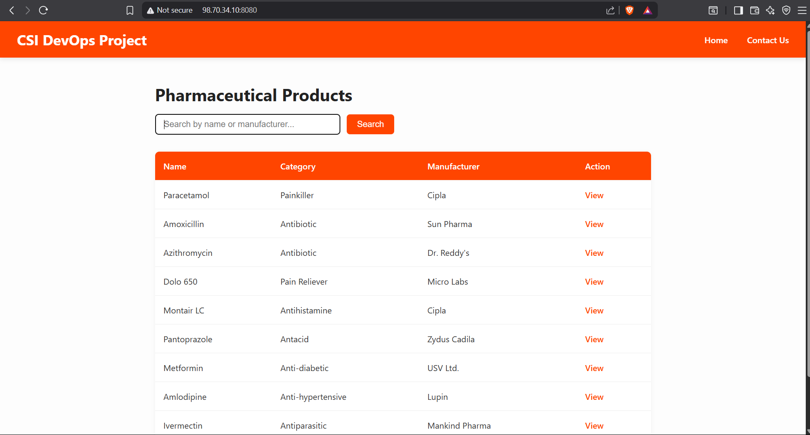

---

### Conclusion

I set up an automated CI/CD pipeline using Azure DevOps to build, containerize, and deploy a Java Spring Boot application to Azure Kubernetes Service (AKS). The pipeline automates the entire process from building the Docker image, pushing it to Azure Container Registry (ACR), and deploying it to AKS with Kubernetes manifests. This setup ensures seamless, continuous deployment with every code change to the main branch.

---