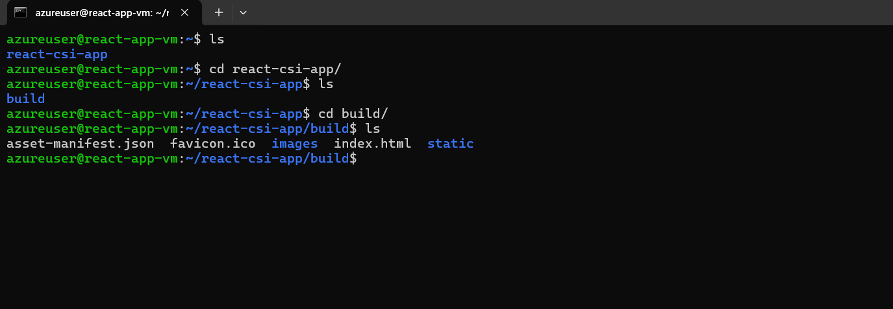

# 📘 Week 8 - Task 10: CI/CD Pipeline to Build and Deploy React Application to Azure Virtual Machine

## Objective

The goal of this task is to **set up an automated CI/CD pipeline using Azure DevOps** that builds a **React application** and deploys it directly to an **Azure Virtual Machine (VM)**. This gives better control over the deployment environment and is suitable for more advanced or customized use cases beyond typical PaaS offerings.

---

### Step 1: Initialize Azure Repos and Import React Application from GitHub

To begin this task, I already had a working **web-based news application** developed using **ReactJS**, which was hosted on my GitHub repository: 

🔗 [https://github.com/Vikas-Prince/TECHWAVE](https://github.com/Vikas-Prince/TECHWAVE)


Instead of creating a new application, I chose to use this existing project to showcase a real-world CI/CD setup.

I followed these steps to integrate the GitHub repository into Azure DevOps:

1. First, I initialized an empty **Git repository** from Azure DevOps by navigating to **Repos → Files** and selected **Initialize** with a README.
2. Then, I imported the code from my GitHub repo into Azure Repos:
   - In Azure Repos, I clicked on **Import repository**.
   - Pasted the GitHub repo URL: `https://github.com/Vikas-Prince/TECHWAVE`.


   - Azure DevOps cloned the repository and pulled the full React project into the Azure Repos Git repo.


This setup gave me a centralized place (Azure DevOps) to manage CI/CD pipelines and track code changes effectively for the deployment.

---


### Step 2: Provision an Azure Virtual Machine

To host the React application, I decided to deploy it on a dedicated **Azure Virtual Machine**. Here's how I provisioned the VM:

1. I navigated to the **Azure Portal**, searched for **Virtual Machines**, and clicked on **+ Create** → **Azure Virtual Machine**.
2. Then I filled in the configuration to align with our setup requirements:

- **Resource Group**: `rg-csi-global`
- **VM Name**: `react-app-vm`
- **Region**: `Central India`
- **Image**: `Ubuntu 24.04 LTS`
- **Size**: `Standard B2als` 
- **Authentication Type**: `SSH Public Key`
- **Username**: `azureuser`

> I used the same SSH key I had previously generated for connecting with the self-hosted agent.

3. After checking the configuration, I clicked on **Review + Create** and then hit **Create** to deploy the VM.
 


4. React Web VM was successfully provisioned.


4. Once the VM was successfully created, I went to the **Networking** tab and ensured the following ports were open in the **Network Security Group (NSG)**:
   - **Port 3000** → For running and accessing the React app in a browser


5. With the VM ready, I connected to it using SSH:

```bash
ssh -i "csi-self-hosted-agent_key.pem" azureuser@20.244.9.19
```


Once inside the VM, I updated system packages and installed Node.js and npm to prepare the environment for React app deployment.

```bash
sudo apt update 
sudo apt install nodejs npm -y
npm install -g pm2
```


---


### Step 3: Create a Service Connection in Azure DevOps (SSH)

With the virtual machine successfully provisioned, the next step was to enable Azure DevOps to securely deploy code to the VM. To do this, I created an **SSH-based service connection** within Azure DevOps. Here's how I did it:

1. I opened **Azure DevOps**, navigated to the **Project Settings** (bottom-left corner).
2. Under the **Pipelines** section, I clicked on **Service Connections**.
3. I selected **New Service Connection** → then chose **SSH** as the connection type.

   

4. I entered the following details:
   - **Host name**: Public IP of the Azure VM
   - **Port**: `22`
   - **Username**: `azureuser`
   - **Private Key**: I pasted the private key content of the existing key pair used during VM provisioning (in `.pem` format).
   - **Service Connection Name**: `ssh-react-app-deploy`

   

5. Finally, I clicked **Save** to complete the setup.

   

The SSH-based service connection named `ssh-react-vm-deploy` was created successfully and is now ready to be used inside deployment pipelines for pushing React code directly to the Azure VM.


---

### Step 4: Creating CI/CD Pipeline to Build & Deploy React App to Azure VM via SSH

After setting up the service connection, my next step was to create a CI/CD pipeline in Azure DevOps to automate the entire process of building the React application and deploying it securely to the Azure virtual machine using SSH.

I navigated to the **Pipelines** section in Azure DevOps and clicked on **New Pipeline**. Here's how I proceeded:


1. Selected **Azure Repos Git** as the source since the `csi-react-app` repository was already hosted there.
2. Chose the repository: `csi-react-app`.


3. Selected **YAML** as the configuration method to define the CI/CD process as code.

> At this point, the pipeline setup opened the `azure-pipelines.yml` editor where I could define each stage from installing dependencies to deploying via SSH.


---

### CI/CD Pipeline Execution Flow

Once I committed the pipeline YAML file to the repo, the pipeline was triggered automatically due to the `trigger` rule defined on the `main` branch.


#### Build Stage

* Used `ubuntu-latest` hosted agent.
* Installed Node.js and verified the version.
* Installed React dependencies using `npm install`.
* Built the React application with `npm run build`.

The build process compiled the application into static assets and stored them in the `build` directory, ready to be deployed.


#### Deploy Stage

* Used an **SSH task** in Azure DevOps to securely connect to the Azure VM using the previously created service connection (`ssh-react-app-deploy`).

Azure DevOps asked for permission to allow the pipeline to use the SSH service connection for deployment. I clicked **Permit** to authorize it.


With permission granted, the pipeline resumed and deployed the build output successfully to the VM.


---

### Step 5: Deployment Verification

Once the pipeline completed successfully, I performed a few checks to verify that the deployment worked as expected:

1. **SSH into VM**: Logged in via terminal and verified that the `build` folder was updated with the latest React build artifacts.



2. **PM2 Process Check**:
   I ran the following command to ensure PM2 was running and serving the React app:
```bash
   pm2 status
   pm2 list
   pm2 logs react-csi-app
```


The app process was up and running.

3. **Browser Check**:

I opened the public IP of the VM with port number 3000 in my browser:
```bash
http://20.244.9.19:3000/
```


The updated React app loaded correctly, confirming that the deployment was successful.


---

### Conclusion

With this setup, I successfully implemented a full CI/CD pipeline using **Azure DevOps** to build and deploy a **React application** to an **Azure Virtual Machine**. From integrating source control, configuring build and deployment stages, to serving the app with PM2, every step was automated and repeatable.

---