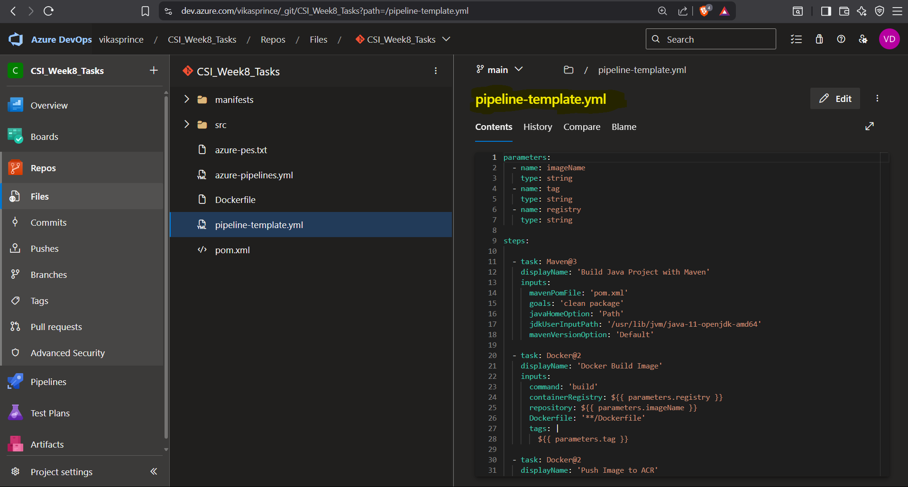
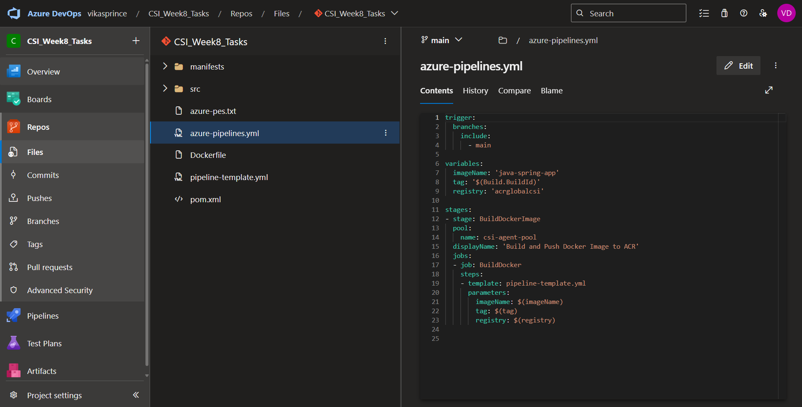
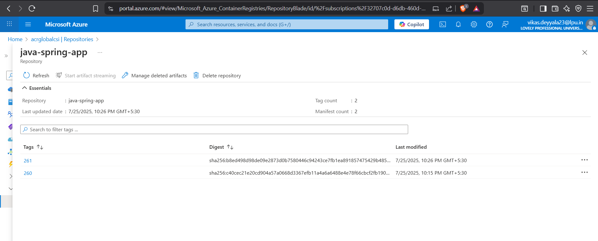
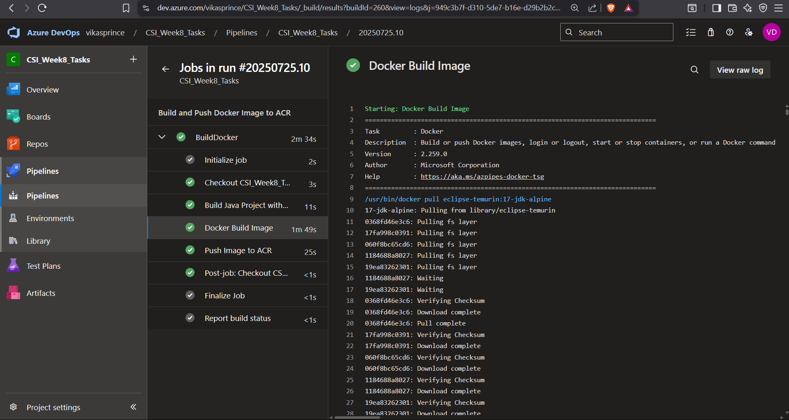

# Week 8 — Task: CI Pipeline Using Variables & Task Groups  

## Objective

The goal of this task was to create a **clean, reusable, and modular CI pipeline** in **Azure DevOps** that:

- Builds a **Java Spring Boot application** using Maven  
- Containerizes the app using **Docker**
- Pushes the image to **Azure Container Registry (ACR)**
- Used **self-hosted agent** for pipeline execution

This was done by combining **pipeline-level variables** and **task groups as templates**, making the CI process scalable across multiple services and environments.

---

### Why we Use Pipeline Variables & Task Groups?

In real-world enterprise projects, especially with microservices, maintaining multiple YAML pipelines often leads to duplication of build logic.

To solve this:
- I extracted common logic (Maven build + Docker build & push) into a **Task Group**, so the steps can be reused across pipelines.
- Defined **pipeline-level variables** to parameterize service-specific values like the Docker image name and ACR registry.

This approach ensures:
- DRY (Don’t Repeat Yourself) pipeline configurations  
- Easy updates in one place  
- Cleaner, dynamic YAML pipelines  

---

### Pipeline-Level Variables

These are defined once and used throughout the pipeline to make it flexible and easy to change in the future:

```bash
variables:
  dockerRegistry: 'myacr.azurecr.io'
  imageName: 'java-spring-app'
  buildId: '$(Build.BuildId)'
```

These variables control:

- `dockerRegistry` — target Azure Container Registry URL
- `imageName` — Docker repository name
- `buildId` — unique tag for each image, using Azure DevOps built-in Build.BuildId

###  Task Group: created a template

I created a Task Group in Azure DevOps named `pipeline-template.yml`. It bundles the key CI tasks into one reusable block:

####  Steps Inside the Task Group:

1. Maven Build Step – Compiles and packages the Java application.
```bash
  - task: Maven@3
    displayName: 'Build Java Project with Maven'
    inputs:
      mavenPomFile: 'pom.xml'
      goals: 'clean package'
      javaHomeOption: 'Path'
      jdkUserInputPath: '/usr/lib/jvm/java-17-openjdk-amd64'
      mavenVersionOption: 'Default'
```

2. Docker Build Step – Builds a Docker image using the generated JAR.

```bash
 - task: Docker@2
    displayName: 'Docker Build Image'
    inputs:
      command: 'build'
      containerRegistry: ${{ parameters.registry }}
      repository: ${{ parameters.imageName }}
      Dockerfile: '**/Dockerfile'
      tags: |
        ${{ parameters.tag }}
```

3. Docker Push Step – Pushes the built image to Azure Container Registry.

```bash
  - task: Docker@2
    displayName: 'Push Image to ACR'
    inputs:
      command: 'push'
      containerRegistry: ${{ parameters.registry }}
      repository: ${{ parameters.imageName }}
      tags: |
        ${{ parameters.tag }}
```



> The Task Group is designed to be reusable across services. Just pass different imageName, tag, and registry values as inputs.

### Final CI Pipeline

Here’s the complete pipeline using the self-hosted agent and the task group:

```bash
trigger:
  branches:
    include:
      - main

variables:
  imageName: 'java-spring-app'
  tag: '$(Build.BuildId)'
  registry: 'acrglobalcsi' 

stages:
- stage: BuildDockerImage
  pool:
    name: csi-agent-pool  
  displayName: 'Build and Push Docker Image to ACR'
  jobs:
  - job: BuildDocker
    steps:
    - template: pipeline-template.yml
      parameters:
        imageName: $(imageName)
        tag: $(tag)
        registry: $(registry)
```



---

### Pipeline Verification: Trigger & Output

Once the code was pushed to the `main` branch, the pipeline was automatically triggered as expected due to the `trigger` directive.

### Pipeline Execution Flow:

1. **Triggered on main push** — Verified in Azure DevOps under the pipeline runs.
2. **Java Build** — Successfully compiled and packaged the Spring Boot app using Maven.
3. **Docker Build** — Docker image was built from the generated JAR.
4. **Push to ACR** — Image was tagged using `$(Build.BuildId)` and pushed to the configured ACR (`acrglobalcsi`).



>  All steps were encapsulated in the template and executed using the self-hosted agent, confirming template reuse and variable injection worked perfectly.



---

## Conclusion

This task helped me understand how to build a clean and flexible CI pipeline using Azure DevOps. By using variables and task groups, I was able to avoid repeating steps and make the pipeline easy to reuse for other projects. The image was built and pushed to ACR successfully using a self-hosted agent, and everything worked smoothly just like in a real-world project setup.

---
