# Week 8 – Advanced Pipelines & Self-Hosted Agent Setup (Azure DevOps)

## Objective

The main goal of this task was to set up a **Linux-based self-hosted agent** in Azure DevOps. This gave me full control over the build environment, allowed custom tooling, and enabled faster debugging for CI/CD pipelines. I used an Ubuntu 22.04 VM, registered it with a custom agent pool, and successfully verified it by running a test pipeline.

---

### Step 1: Provisioning the Ubuntu Virtual Machine

I started by provisioning a virtual machine in my cloud environment using Ubuntu 22.04 as the base image. Once the provisioning was complete and the VM was up and running,

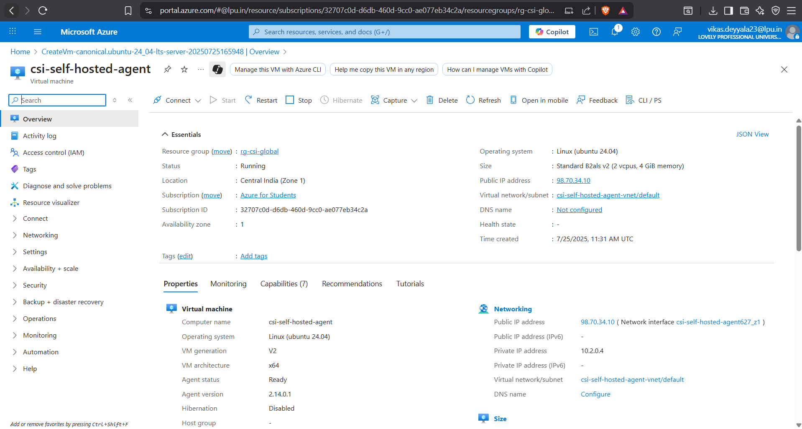

I accessed it via SSH from my local system.

```bash
ssh azureuser@<your-vm-public-ip>
```

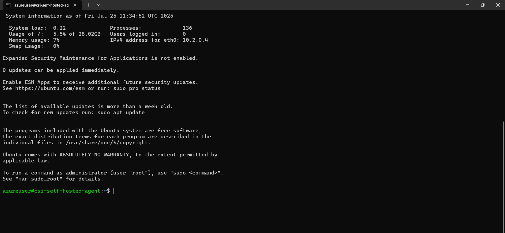

---

### Step 2: Creating a Self-Hosted Agent Pool in Azure DevOps

After logging into the VM, I moved to my Azure DevOps Organization to configure a new agent pool for self-hosted agents:

1. Navigated to my **Azure DevOps Project**
2. Clicked on **Project Settings** → **Agent Pools** (under Pipelines)

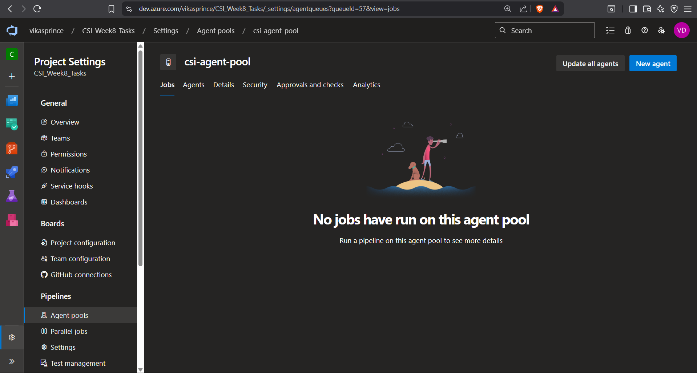

3. Selected **"Add Pool"**, gave it the name: `csi-hosted-agent-pool`
4. Chose **"Self-hosted"** as the agent type

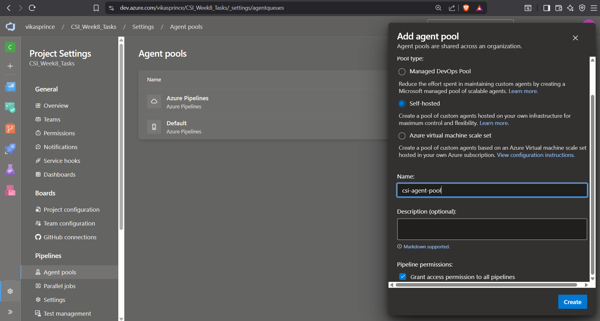

5. Clicked **Create** to finalize the pool

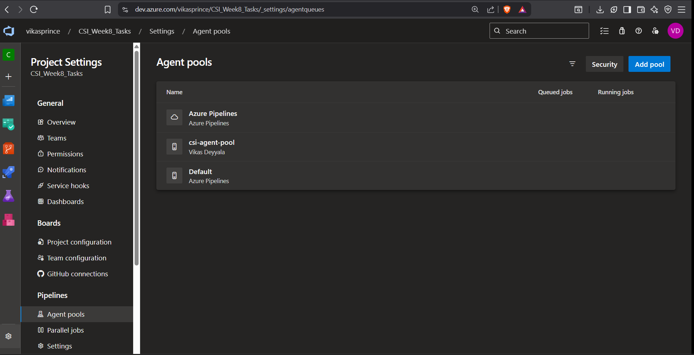

This pool would act as the container to register and manage any custom-hosted agents.

---

### Step 3: Installing the Linux Agent on the VM

Once the pool was created, I clicked on new agent to create, Azure DevOps provided setup instructions based on the OS.

I selected **Linux** and followed the steps as below:

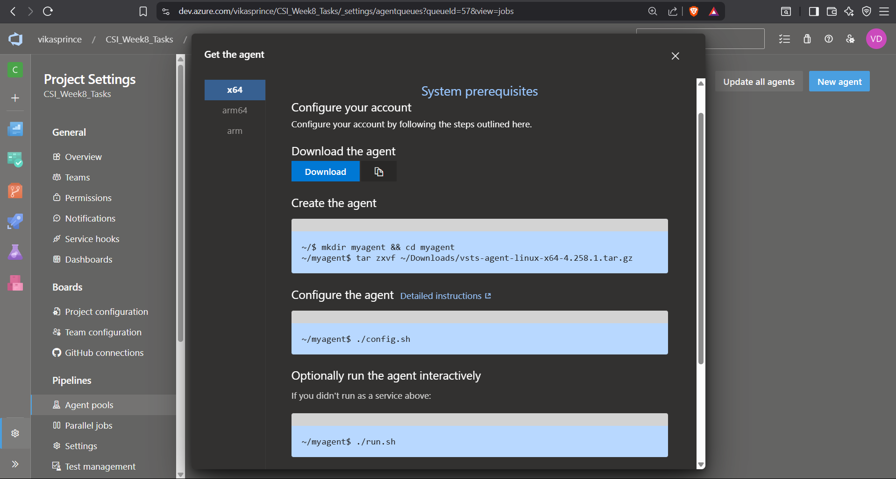

1. **Downloaded the agent package** using `wget`:

   ```bash
   wget https://vstsagentpackage.azureedge.net/agent/3.236.0/vsts-agent-linux-x64-3.236.0.tar.gz
   ```

2. **Created a dedicated directory** for the agent:

```bash
mkdir myagent && cd myagent
```

3. **Extracted the downloaded archive**:

```bash
tar zxvf ../vsts-agent-linux-x64-3.236.0.tar.gz
```

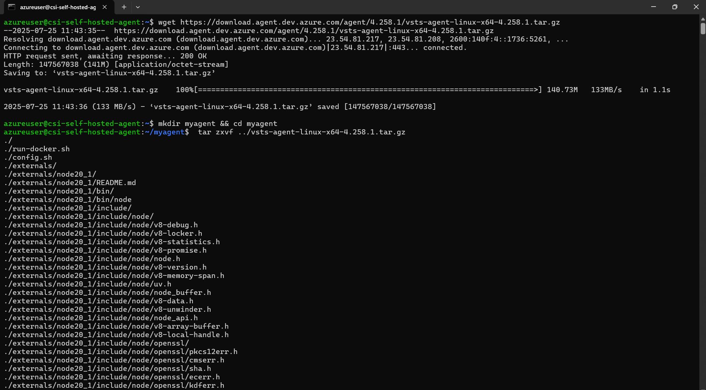

---

### Step 4: Configuring the Agent (./config.sh)

To initialize the agent, I ran the following command:

```bash
./config.sh
```

This interactive setup asked me for a few things:

* **Organization URL**: I provided my Azure DevOps organization URL → `https://dev.azure.com/vikasprince`
* **Authentication Type**: I chose `PAT (Personal Access Token)`

Then, I went back to the Azure DevOps portal:

1. Clicked on the **user icon (top-right)** → **Personal Access Tokens**
2. Created a new token named `csi-agent-pat` (for demo/testing)
3. Granted **full access** for initial setup (Note: this is **not recommended** for production; use scoped access)

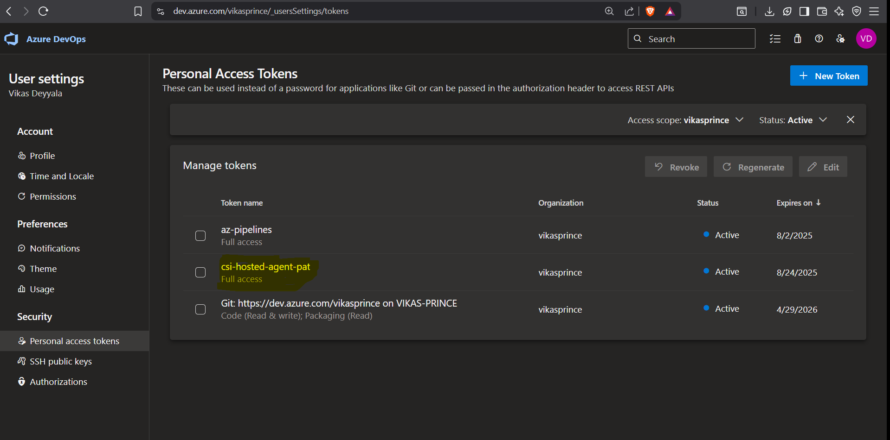

Back on the VM, I entered the PAT when prompted and continued with the setup:

* Provided **Agent Pool**: `csi-hosted-agent-pool`
* Named the Agent: `csi-agent`

Once the configuration completed successfully, the agent was now registered with Azure DevOps.

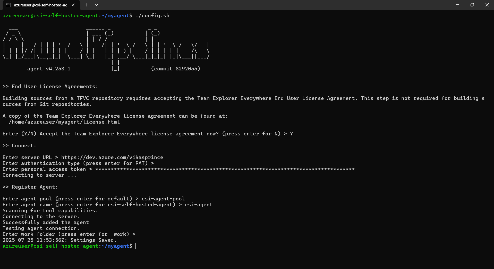

---

### Step 5: Starting the Agent (./run.sh)

To run the agent so it can pick up jobs from the pipeline, I executed:

```bash
./run.sh
```

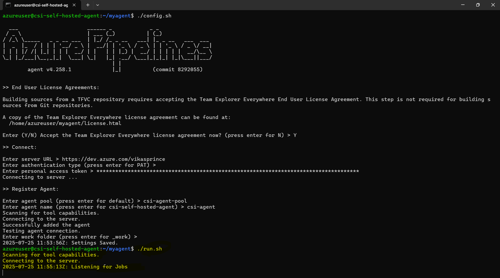

This started the agent and it began polling Azure DevOps for available jobs.

---

### Step 6: Verification from Azure DevOps Portal

To verify if everything worked correctly:

1. I navigated back to the Azure DevOps portal
2. Went to **Agent Pools** → `csi-hosted-agent-pool`
3. There I saw the `csi-agent` showing as **Online** 

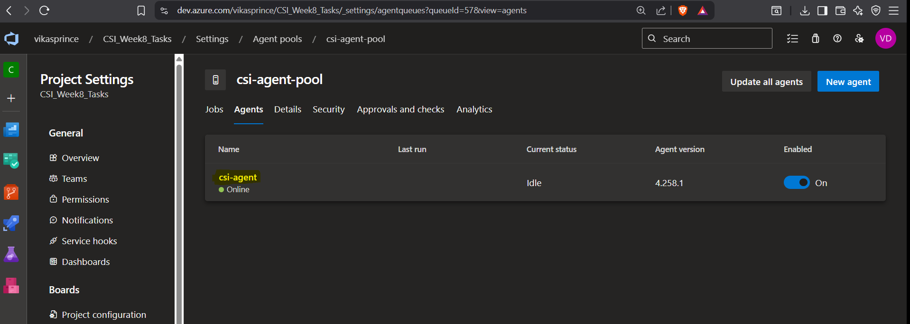

This confirmed that my self-hosted agent was live and ready to handle builds and releases.

---

### Step 7: Running a Test Pipeline

With my agent successfully connected and verified, I created a simple test pipeline. I targeted the custom agent pool to confirm the build agent could execute jobs seamlessly.

```bash
pool:
  name: csi-hosted-agent-pool

steps:
  - script: echo "Running from self-hosted agent"
    displayName: "Verify Self-Hosted Agent"
```

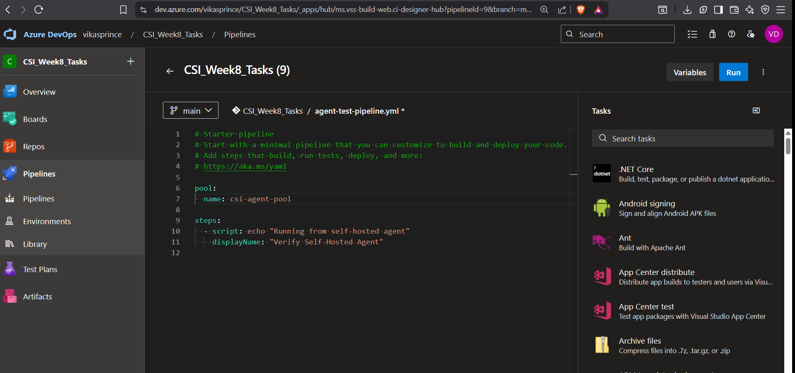

This job executed successfully on the self-hosted agent, marking the completion of Task.

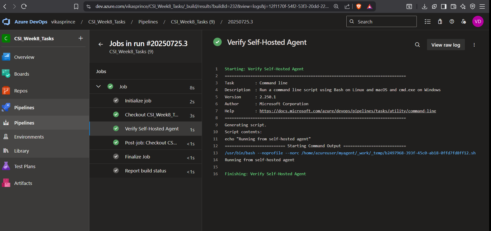

Finally to verify that weather those jobs are correctly executed under created self hosted agent pool, for that i went to agent pools under `csi-agent-pool` all executed jobs are listed. Hence my self hosted linux agent working as expected

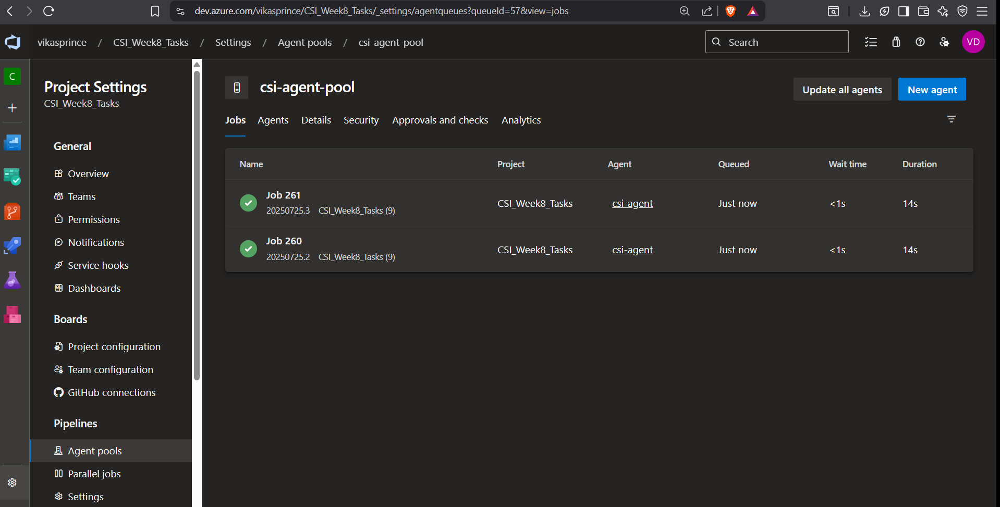

With the self-hosted agent in place, I used it for all upcoming tasks in this week — including pipeline variables, variable groups, scoped values per environment, and gated release approvals.

---

### Conclusion

Setting up the self-hosted agent was smooth and straightforward. After configuring and running the agent, I confirmed that it was online and able to execute pipelines from Azure DevOps. This setup will now serve as the backbone for all advanced tasks, making my builds more efficient and flexible.

---